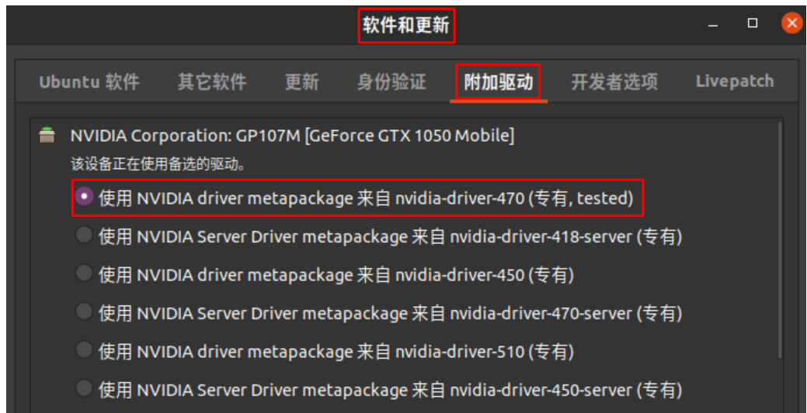
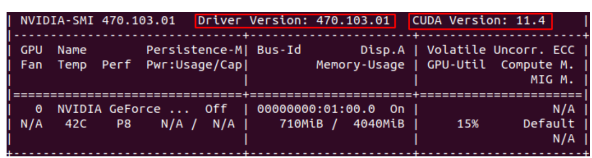
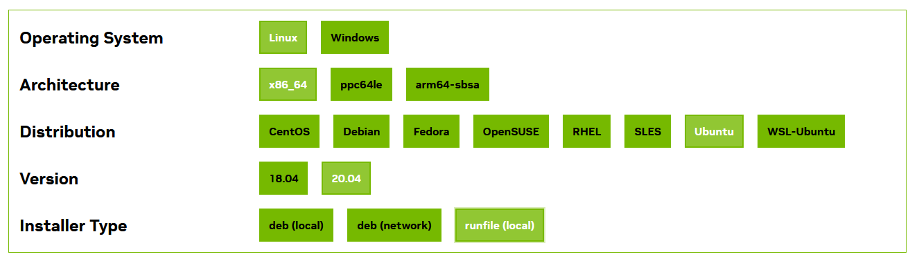
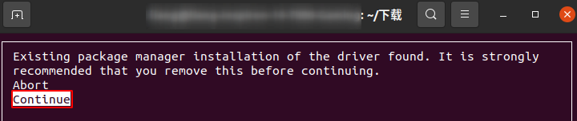
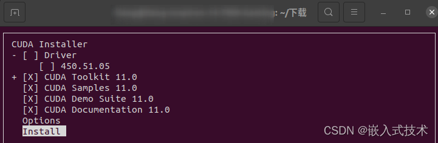
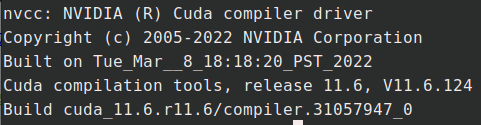
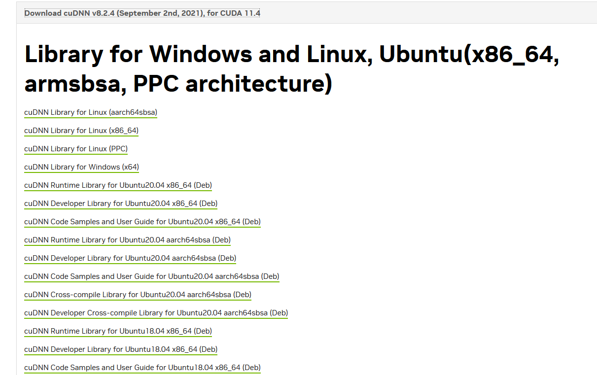
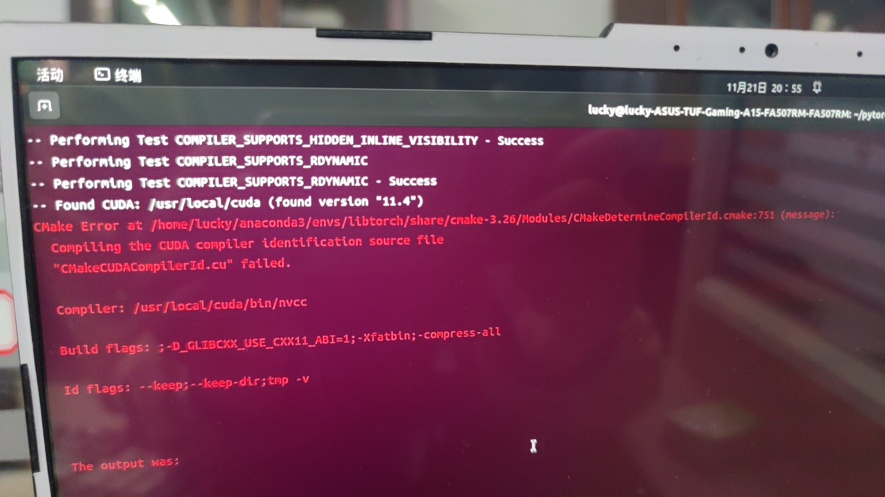

# 编译cuBLAS-cuDNN（ubantu)

## 1. CUDA 安装

### 1.1 NVIDIA驱动安装

buntu20.04 安装NVIDIA驱动很容易，只只需要打开系统设置->软件和更新->附加驱动->选择NVIDIA驱动->应用更改。该界面会自动根据电脑上的GPU显示推荐的NVIDIA显卡驱动。



### 1.2 查看自己GPU支持的最大cuda

```shell
$ nvidia-smi
```



### 1.3 安装cuda

去官网https://developer.nvidia.com/cuda-toolkit-archive

选择自己版本的CUDA  Toolkit 点击进去

选择Linux->x86_64->Ubantu->20.04->runfile(local)



跟随下面的安装指令

例如

```shell
# 下载
$ wget https://developer.download.nvidia.com/compute/cuda/11.4.4/local_installers/cuda_11.4.4_470.82.01_linux.run
# 运行
$ sudo sh cuda_11.4.4_470.82.01_linux.run
```

运行上面指令后，会弹出如下界面，点击`Continue`，然后再输入`accept`。



接着，如下图所示，在弹出的界面中通过`Enter`键，取消`Driver`和`450.51.05`的安装，然后点击`Install`，等待，因为驱动已经安装过了



配置环境变量

需要修改/home/yourname/.bashrc

```shell
# 进入主目录
$ cd
# 使用vim修改
$ vim ~/.bashrc
# 如果没有vim的话可以选择安装或者直接打开文件修改
$ sudo apt install vim
# 在文件末尾添加
export PATH=$PATH:/usr/local/cuda/bin  
export LD_LIBRARY_PATH=$LD_LIBRARY_PATH:/usr/local/cuda/lib64 
# vim基本使用 进入文件后使用方向键移动到文件末尾，按i进入编辑模式，添加文件后，按Esc退出编辑模式进入命令模式，再按住shift + ： 在输入wq保存退出文件
# 更新环境变量
$ source ~/.bashrc
# 确认cuda是否安装成功
$ nvcc -v
```



cuda默认位置是/usr/local,在安装完cuda也可以去该目录下查看。

---

---

---


## 2. cuDNN安装

进入https://developer.nvidia.com/rdp/cudnn-archive寻找与自己cuda对应的cuDNN



下载cuDNN Library for Linux(x86_64) 

下载时可能需要注册nvidia账户

完成后

```shell
# 解压
$ tar -zxvf cudnn-11.0-linux-x64-v8.0.5.39.tgz
# 然后，使用下面两条指令复制cuda文件夹下的文件到/usr/local/cuda-11.0/lib64/和/usr/local/cuda-11.0/include/中。
$ cp cuda/lib64/* /usr/local/cuda-11.0/lib64/
$ cp cuda/include/* /usr/local/cuda-11.0/include/
# 查看cudnn信息
cat /usr/local/cuda-11.0/include/cudnn_version.h | grep CUDNN_MAJOR -A 2
```

## 3. 编译cuBLAS和cuDNN

cublas 
```cmake
cmake -G Ninja \
-DBUILD_PYTHON=OFF \
-DUSE_CUDA=ON \
-DUSE_CUDNN=OFF \
-DUSE_CUBLAS=ON \
-DUSE_NCCL=OFF \
-DUSE_OPENMP=ON \
-DUSE_XNNPACK=OFF \
-DBUILD_CAFFE2=OFF \
-DUSE_MKLDNN=OFF \
-DUSE_FBGEMM=OFF \
-DUSE_PYTORCH_QNNPACK=OFF \
-DUSE_EIGEN_FOR_BLAS=OFF \
-DUSE_QNNPACK=OFF \
-DUSE_KINETO=OFF \
-DUSE_NNPACK=OFF \
-DUSE_MKL=OFF \
-DUSE_MKLDNN=OFF \
-DBUILD_CAFFE2_OPS=OFF \
-DBUILD_SHARED_LIBS:BOOL=ON \
-DCMAKE_BUILD_TYPE:STRING=Debug \
-DCMAKE_INSTALL_PREFIX:PATH=../libtorch \
-DCMAKE_C_COMPILER=/usr/bin/gcc \
-DCMAKE_CXX_COMPILER=/usr/bin/g++ \
../
```

cudnn

```cmake
cmake -G Ninja \
-DBUILD_PYTHON=OFF \
-DUSE_CUDA=ON \
-DUSE_CUDNN=ON \
-DUSE_CUBLAS=ON \
-DUSE_NCCL=OFF \
-DUSE_OPENMP=ON \
-DUSE_XNNPACK=OFF \
-DBUILD_CAFFE2=OFF \
-DUSE_MKLDNN=OFF \
-DUSE_FBGEMM=OFF \
-DUSE_PYTORCH_QNNPACK=OFF \
-DUSE_EIGEN_FOR_BLAS=OFF \
-DUSE_QNNPACK=OFF \
-DUSE_KINETO=OFF \
-DUSE_NNPACK=OFF \
-DUSE_MKL=OFF \
-DUSE_MKLDNN=OFF \
-DBUILD_CAFFE2_OPS=OFF \
-DBUILD_SHARED_LIBS:BOOL=ON \
-DCMAKE_BUILD_TYPE:STRING=Debug \
-DCMAKE_INSTALL_PREFIX:PATH=../libtorch \
-DCMAKE_C_COMPILER=/usr/bin/gcc \
-DCMAKE_CXX_COMPILER=/usr/bin/g++ \
../
```

## 4.问题

1. 问题，编译的时候需要知道自己cuda支持的gcc版本

这就是gcc版本过高，换成gcc-9就不会报错。

2. 在使用时出现很多语法错误

选用c++17修改cmakeLIsts.txt.

## 5. 参考链接

cndnn和cuda安装 https://blog.csdn.net/weixin_37926734/article/details/123033286