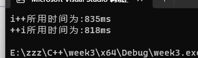
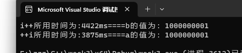

# Week3-小作业

题目： 比较i++和++i速度快慢。

## 1. for循环中比较

测试代码

```c++
#include<iostream>
#include <time.h>
using namespace std;


int main() {

	clock_t start = clock();
	for (int i = 0; i <= 2000000000; i++) {
	}

	cout << "i++所用时间为:" << double(clock() - start) << "ms" << endl;

	clock_t start1 = clock();


	for (int i = 0; i <= 2000000000; ++i) {

	}

	cout << "++i所用时间为:" << double(clock() - start1) << "ms" << endl;

}

```

第一次



第二次


第三次


## 2. i++和++i的区别

区别1： i++执行顺序是先赋值后执行i+1， ++i执行顺序是先i+1后赋值。

区别2： i++最终返回值没有地址，++i返回的地址为i本身

测试：

```c++
#include<iostream>

using namespace std;

int main() {
	int i = 5;
	cout << "i的地址为：" << &i << endl;
	cout << "++i的地址为:" << &(++i) << endl;
	return 0;
}
```

输出结果：


```c++
#include<iostream>

using namespace std;

int main() {
	int i = 5;
	cout << "i的地址为：" << &i << endl;
	cout << "i++的地址为:" << &(i++) << endl;
	return 0;
}
```

输出结果：

编译报错： E0158	表达式必须为左值或函数指示符	

说明：i++的结果是不具名的，也无法取地址


## 3. 通过函数int &operator++()和函数int operator++(int) 测试速度

1. 编写类compareSpeed

```c++
#include<iostream>

class CompareSpeed
{
public:
	int a = 0;
	int b = 0;
	// ++i的实现
	int& operator++() {
		a += 1;
		return a;
	}
	 // i++的实现
	int operator++(int) {
		int temp = b;
		b += 1;
		return temp;
	}
};
```

2. 测试速度

```c++
#include "CompareSpeed.h"
#include<iostream>
#include<windows.h>
using namespace std;

int main() {
	CompareSpeed cs;
	DWORD start = GetTickCount64();
	
	
	for (int i = 0; i <= 1000000000; i++) {
		cs.operator++(cs.b);
	}
	DWORD end = GetTickCount64();
	cout << "i++所用时间为:" <<(end - start) << "ms====b的值为：" << cs.b<< endl;

	DWORD start1 = GetTickCount64();

	for (int i = 0; i <= 1000000000; i++) {
		cs.a = cs.operator++();
	}
	DWORD end1 = GetTickCount64();
	cout << "++i所用时间为:" << (end1 - start1) << "ms====a的值为：" << cs.a << endl;

	return 0;
}
```

3. 结果分析

第一次：



第二次：


第三次：


结论：==++i的效率比i++快==

