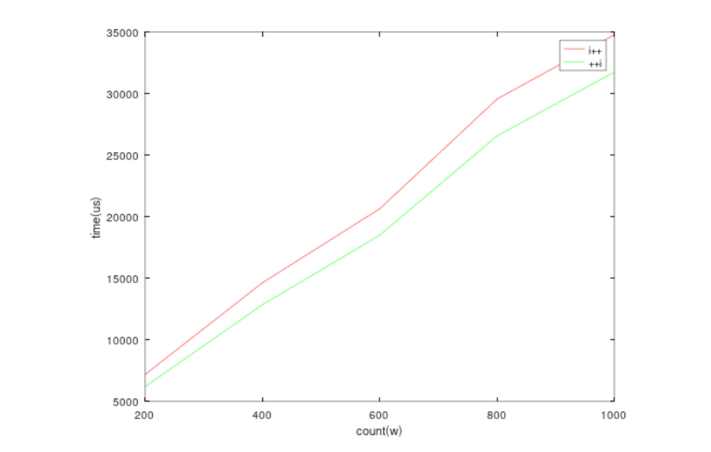
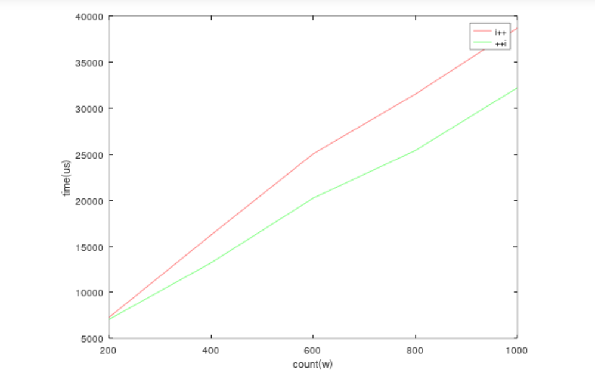
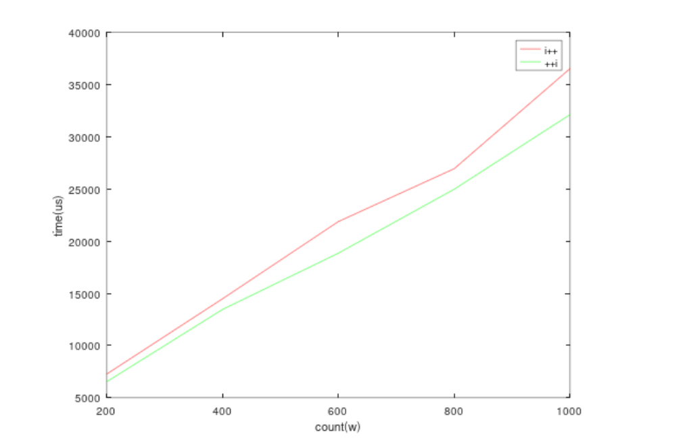

# week3-小作业_2

**不用clock_t的原因:** clock()函数测量的是处理器的CPU时间，而不是实际的时间或者时钟，当开启多线程的时候，就会发现实际的时间比CPU的时间快多了。


## 1.实验的环境

软硬件环境

| 设备名称 | 设备型号                                             |
| -------- | ---------------------------------------------------- |
| CPU      | AMD Ryzen 7 6800H with Radeon Graphics      3.20 GHz |
| 操作系统 | Windows 11                                           |
| 机带RAM  | 16.0GB                                               |
| 编译器   | visual Studio                                        |

编译器环境

| 配置属性     | 属性值                |
| ------------ | --------------------- |
| C++标准语言  | ISO c++14标准         |
| 运行库       | 多线程调试 DLL (/MDd) |
| 优化         | 如下                  |
| 多处理器编译 | 是(/MP)               |

Debug时不采用优化：


release模式下优化等级最高:


## 2. 比较i++和++i速度

实验方案： 比较int(4字节) long long(8字节)  float(4字节) double(8字节) 数据类型 分别进行2000,000 4000,000 600,0000 800,0000 1,0000,000 时i++和++i的运行时，各取3次求平均值.

测试代码如下：

```c++
//方法实现类的代码
#include<iostream>

class CompareSpeed
{
private:
	int a = 0;
public:
	
	// ++i的实现
	int& operator++() {
		this->a += 1;
		return this->a;
	}
	 // i++的实现
	int operator++(int) {
		int temp = this->a;
		this->a += 1;
		return temp;
	}
	int getA() {
		return a;
	}

	void initA() {
		this->a = 0;
	}
};

// 测试代码
#include <iostream>
#include <chrono>
#include "CompareSpeed.h"

using namespace std;

const int COUNT = 10000000;

int main() {
	CompareSpeed cs;
	double computeHead[3] = { 0,0,0 };
	double computeBack[3] = { 0,0,0 };
	for (int j = 0; j < 3; ++j) {
		auto old = chrono::system_clock().now();

		for (int i = 0; i < COUNT; ++i)
		{
			++cs;
		}
		computeHead[j] = (double)chrono::duration<double, micro>(chrono::system_clock::now() - old).count();
		cout << "++i所用时间为:" << computeHead[j] << "us;a的值为：" << cs.getA() << endl;
		cs.initA();
		auto old1 = chrono::system_clock().now();
		for (int v = 0; v < COUNT; ++v)
		{
			cs++;
		}
		computeBack[j] = (double)chrono::duration<double, micro>(chrono::system_clock::now() - old1).count();
		cout << "i++所用时间为:" << computeBack[j] << "us;a的值为" << cs.getA() << endl;
	}
	
	cout << "++i的平均运行时为:" << (computeHead[0] + computeHead[1] + computeHead[2]) / 3 << endl;
	cout << "i++的平均运行时为:" << (computeBack[0] + computeBack[1] + computeBack[2]) / 3 << endl;
	return 0;
}
```


### int

| count\类型 | i++(us) | ++i（us) |
| ---------- | ------- | -------- |
| 200w       | 7195.8  | 6207.1   |
| 400w       | 14636.4 | 12855    |
| 600w       | 20645.3 | 18499.9  |
| 800w       | 29558.4 | 26561.9  |
| 1000w      | 34776.2 | 31747.7  |

如下图



### long

方法实现类改变

```c++
#include<iostream>

class CompareSpeed
{
private:
	long a = 0;
public:
	
	// ++i的实现
	long& operator++() {
		this->a += 1;
		return this->a;
	}
	 // i++的实现
	long operator++(int) {
		long temp = this->a;
		this->a += 1;
		return temp;
	}
	int getA() {
		return a;
	}

	void initA() {
		this->a = 0;
	}
};
```


| count\类型 | i++(us) | ++i（us) |
| ---------- | ------- | -------- |
| 200w       | 7286.23 | 7066.53  |
| 400w       | 16237.9 | 13213.5  |
| 600w       | 25040.7 | 20232.8  |
| 800w       | 31520.7 | 25402.3  |
| 1000w      | 38707.4 | 32219.2  |

如下图：




---


### float

| count\类型 | i++(us) | ++i（us) |
| ---------- | ------- | -------- |
| 200w       | 6457.77 | 6216.8   |
| 400w       | 14555.7 | 13279.4  |
| 600w       | 20332.7 | 19141.8  |
| 800w       | 26848.7 | 25037.7  |
| 1000w      | 34430   | 32097.3  |


### double

| count\类型 | i++(us) | ++i（us) |
| ---------- | ------- | -------- |
| 200w       | 7265.3  | 6531.83  |
| 400w       | 14476.9 | 13454.4  |
| 600w       | 21870.2 | 18844    |
| 800w       | 26933.2 | 24966.3  |
| 1000w      | 36518   | 32112.6  |



### 比较不同变量类型i++的运行时


## 3.总结

由图像可以知道，++i的运行时比i++少，且当变量类型字节长度变长时，他们之间相差的速度越大。

字节长度变长时，运算所需要的时间更多。

