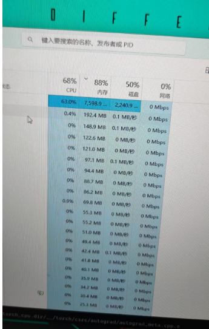

## 1. Docker deskTop安装 windows

### 1.1 开启Hyper-V

#### 1.1.1 Hyper-v 下载

如果是windows家庭版的话没有Hyper-V需要手动下载

编辑脚本

```bash
pushd "%~dp0"

dir /b %SystemRoot%\servicing\Packages\*Hyper-V*.mum >hv.txt

for /f %%i in ('findstr /i . hv.txt 2^>nul') do dism /online /norestart /add-package:"%SystemRoot%\servicing\Packages\%%i"

del hv.txt

Dism /online /enable-feature /featurename:Microsoft-Hyper-V -All /LimitAccess /ALL

Pause
```

保存为Hyper-V.bat 以管理员身份运行即可下载

#### 1.1.2 Hyper-v启动

搜索控制面板>>选择程序和功能>>在左边，启用或关闭Windows功能中选择Hyper-V.如下图：


### 1.2 安装Docker-DeskTop

#### 1.2.1 注册dockerhub账号（可能需要挂梯子）

#### 1.2.2 下载Docker-DeskTop

https://www.docker.com/ 1.2.1 1.2.2 进入此链接操作

#### 1.2.3 验证

打开windows powershell 运行

```shell
$ docker run hello-world
```

#### 1.2.4 常用命令以及基本配置

```shell
#查看所有容器 不加-a 只会显示已经启动的容器
$ docker ps -a
#查看镜像 
$ docker images
# 搜索镜像
$ docker search imageName
# 下载镜像
$ docker pull imageName
#创建并交互式进入容器，-it表示交互式，-v表示挂载本地文件
$docker run -it -v D:\DockerWork:\home\work --name containerName IMAGENAME
#下面是一个示例
$ docker run -it -v E:\DockerContain:/home/work --name test pytorch/libtorch-cxx11-builder:cpu
#开始/暂停/删除容器
$ docker start/stop/rm ID/Name
#交互式进入一个运行中的容器 使用docker run创建完容器后下次进入交互式只需要执行下面的命令 
$ docker exec -it ID/Name bash
#阿里源配置
{
  "builder": {
    "gc": {
      "defaultKeepStorage": "20GB",
      "enabled": true
    }
  },
  "experimental": false,
  "features": {
    "buildkit": true
  },
  "registry-mirrors": [
    "https://alzgoonw.mirror.aliyuncs.com"
  ]
}
```

---

---


## 2. 使用docker编译libtorch

### 2.1 拉取libtorch镜像

#### 2.1.1 命令行操作

```shell
# 搜索镜像
$ docker search libtorch
# 下载镜像 tag为cpu
$ docker pull pytorch/libtorch-cxx11-builder:cpu
```

#### 2.1.2 docker deskTop操作

在顶部搜索框搜索Libtorch(可能需要翻墙)


tag要选为自己需要的

直接点击pull下载

### 2.2 下载Pytorch源码

最新版 git clone --recursive https://github.com/pytorch/pytorch

或者：

百度网盘

链接：https://pan.baidu.com/s/1JxpOzR0hOuhjlv1Dqzm9YA?pwd=0000 
提取码：0000 

### 2.3 编译源码

进入pytorch目录下

```shell
$ mkdir build
$ cd build
$cmake -G Ninja \
-DUSE_CUDA=OFF \
-DUSE_CUDNN=OFF \
-DUSE_NCCL=OFF \
-DUSE_OPENMP=ON \
-DUSE_XNNPACK=OFF \
-DBUILD_CAFFE2=OFF \
-DUSE_MKLDNN=OFF \
-DUSE_FBGEMM=OFF \
-DUSE_PYTORCH_QNNPACK=OFF \
-DUSE_QNNPACK=OFF \
-DUSE_KINETO=OFF \
-DUSE_NNPACK=OFF \
-DBUILD_CAFFE2_OPS=OFF \
-DBUILD_SHARED_LIBS:BOOL=ON \
-DCMAKE_BUILD_TYPE:STRING=Debug \
-DCMAKE_INSTALL_PREFIX:PATH=../libtorch \
../pytorch
$ ninja install
```

第三个命令根据需求自己选择开启某些选项或者关闭某些选项

### 2.4 测试是否编译成功

#### 2.4.1 文件验证

会生成libtorch文件夹：里面包括bin,include,lib,share

#### 2.4.2 代码验证

创建一个目录，编写CMakeLists.txt文件

```txt
cmake_minimum_required(VERSION 3.0)
project("week 8")

set(Torch_ROOT "/home/work/libtorch") #libtorch的路径
list(APPEND CMAKE_PREFIX_PATH "/home/work/libtorch")
find_package(Torch REQUIRED NO_MODULE ) #添加torch

SET(CMAKE_CXX_FLAGS "${CMAKE_CXX_FLAGS} -Ofast -march=native") #编译的优化选项

add_executable(test_example test.cpp)


target_link_libraries(test_example ${TORCH_LIBRARIES}) #给test链接torch
```

test.cpp

```cpp
#include<torch/torch.h>
#include<iostream>
//using namespace std;

int main(){
 torch::Tensor tensor = torch::eye(3);
 std::cout << tensor << std::endl;
 std::cout<<torch::show_config()<<std::endl;
}
```

运行脚本

```shell
$mkdir build
$cmake ..
$make 
$./test_example
```


## 3. 环境

### 3.1 windows环境

| 环境名称    | 型号                                                       |
| ----------- | ---------------------------------------------------------- |
| windows系统 | Windows 11 家庭中文版                                      |
| Cpu         | AMD Ryzen 7 6800H with Radeon Graphics            3.20 GHz |
| 内存大小    | 32G                                                        |

### 3.2 docker中的环境

| 环境名称 | 型号                 |
| -------- | -------------------- |
| gcc      | gcc version 13.1.0   |
| ubantu   | Ubuntu 20.04.6 LTS   |
| Cmake    | cmake version 3.18.2 |

## 4. 问题

1. pytorch源码下载不完整

问题出现：发生在 cmake .. xxxxxxx中

问题形式1：

问题形式2：

```shell
ninja: error: build.ninja:56612: multiple rules generate caffe2/CMakeFiles/torch_cpu.dir/__/aten/src/ATen/UfuncCPUKernel_add.cpp.DEFAULT.cpp.o [-w dupbuild=err]
```

解决办法:用2.2中百度网盘已经下载好的

2. 内存不够的问题

问题出现： cmake 后 编译的时候

问题形式1：

问题形式2： 发生在编译完链接的时候

他会在链接一段时间后直接退出程序，原因大概是因为内存使用过高，windows会杀死占用内存率最高的内存，我在链接的时候从docker后台看到docker内存使用的峰值达到了9.33G.



解决办法：更换硬件，换个较大的内存条。

3 . c++版本不够 

问题出现：在使用cmake测试编译出来的libtorch的时候

问题形式: 

大致意思是说需要c++17 

可能的解决方法（没试过）

```cmake
set(CMAKE_CXX_STANDARD 17)
```

因为从GCC 5版本开始，到GCC 7版本，已基本完全支持c++17。 镜像的默认版本是gcc-9

解决方法1：

升级gcc-13

具体做法：

```shell
# 更换ubantu软件源地址
$ sed -i -e 's/:\/\/(archive.ubuntu.com\|security.ubuntu.com)/old-releases.ubuntu.com/g' /etc/apt/sources.list 
# 检测可更新的软件包
$ apt upgrade
# 安装软件包software-properties-common
$ apt install software-properties-common
# 添加 Ubuntu Toolchain Test Builds 团队的软件源
$ add-apt-repository ppa:ubuntu-toolchain-r/test
# 更新软件包数据库
$ apt update
# 安装gcc-13和g++-13 -y选项可以应答所有确认提示
$ apt install gcc-13 g++-13 -y
# 到指定目录 更改命令的软连接 在更改前需要删除之前的软连接 如rm gcc rm g++
$ cd /usr/bin/
$ ln -s gcc-13 gcc
$ ln -s g++-13 g++
# 安装完后 输入gcc -v 查看是否更新完成
$ gcc -v
```


