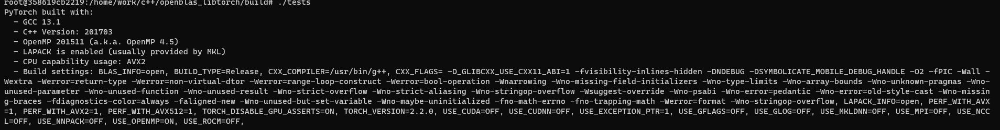

# 编译libtorch_openblas

## 1. openblas编译和安装

### 1.1 介绍

openblas是cpu的线性代数库，和eigen和mkl一样都是CPU的线性代数库。

### 1.2 下载

- 下载源码： git clone https://github.com/OpenMathLib/OpenBLAS.git
- 下载压缩包:  https://codeload.github.com/OpenMathLib/OpenBLAS/zip/refs/heads/develop

- git链接:https://github.com/OpenMathLib/OpenBLAS

### 1.3 安装

我选择的是下载压缩包，下完压缩包后放在/home/yourname/ 目录下，解压

```shell
$ unzip OpenBLAS-develop.zip
# 进入解压目录
$ cd OpenBLAS-develop
# 编译-j8表示使用 8 个并行任务来进行编译。这样可以加快编译速度，特别是在拥有多个处理器核心或线程的系统上。
$ make -j8
# 安装 建议不要指定选择默认路径安装 默认安装的路径在:/opt/OpenBLAS
# 在中间添加参数PREFIX=/usr/Tool/OpenBLAS-develop 可以指定安装目录
$ make install 
```


---

## 2. 编译Libtorch

### 2.1 cmake 构建编译文件

1. 进入pytorch目录
2. cmake 

```shell
# 如果build目录存在，删除build 
$ rm -rf build
# 创建build文件夹
$ mkdir build
# 进入build文件夹
$ cd build
# 设置openBLAS的环境变量
export OpenBLAS_HOME=/opt/OpenBLAS/
# cmake
# 如果需要编译Debug版的，-DCMAKE_BUILD_TYPE:STRING=Release \ ->-DCMAKE_BUILD_TYPE:STRING=Debug \
cmake -G Ninja \
-DBUILD_PYTHON=OFF \
-DUSE_CUDA=OFF \
-DUSE_CUDNN=OFF \
-DUSE_NCCL=OFF \
-DUSE_OPENMP=ON \
-DUSE_BLAS=ON \
-DBLAS=OpenBLAS \
-DUSE_XNNPACK=OFF \
-DBUILD_CAFFE2=OFF \
-DUSE_MKLDNN=OFF \
-DUSE_FBGEMM=OFF \
-DUSE_PYTORCH_QNNPACK=OFF \
-DUSE_EIGEN_FOR_BLAS=OFF \
-DUSE_QNNPACK=OFF \
-DUSE_KINETO=OFF \
-DUSE_NNPACK=OFF \
-DUSE_MKL=OFF \
-DUSE_MKLDNN=OFF \
-DBUILD_CAFFE2_OPS=OFF \
-DBUILD_SHARED_LIBS:BOOL=ON \
-DCMAKE_BUILD_TYPE:STRING=Release \
-DCMAKE_INSTALL_PREFIX:PATH=../libtorch \
-DCMAKE_C_COMPILER=/usr/bin/gcc \
-DCMAKE_CXX_COMPILER=/usr/bin/g++ \
../
```

如遇到错误，看下面问题集合。

确认自己是否使用到了openblas库，

看build -> CmakeCache.txt

```txt
54行
//Selected BLAS library
BLAS:STRING=OpenBLAS
911行
//Path to a file.
OpenBLAS_INCLUDE_DIR:PATH=/opt/OpenBLAS/include

//Path to a library.
OpenBLAS_LIB:FILEPATH=/opt/OpenBLAS/lib/libopenblas.so
```

### 2.2 ninja install

在build目录下运行ninja install

### 2.3 测试

创建目录，编写CMakeLists.txt文件

```txt
cmake_minimum_required(VERSION 3.0)
project("openblas")

set(Torch_ROOT "/home/work/pytorch/libtorch") #libtorch的路径
list(APPEND CMAKE_PREFIX_PATH "/home/work/pytorch/libtorch")
find_package(Torch REQUIRED NO_MODULE ) #添加torch

SET(CMAKE_CXX_FLAGS "${CMAKE_CXX_FLAGS} -Ofast -march=native") #编译的优化选项

add_executable(tests test.cpp)


target_link_libraries(tests ${TORCH_LIBRARIES}) #给test链接torch
```

test.cpp

```cpp
#include <torch/torch.h>
#include <iostream>

int main() {
   

    std::cout<<torch::show_config()<<std::endl;

    return 0;
}
```

```shell
$ mkdit build
$ cd build
$ cmake ..
$ make 
$ ./tests
```



BLAS_INFO=open LAPACK_INFO =open

## 3. 问题

如果你们有什么其他的问题，也可以放在下面。

### 3.1 cmake .. 问题

1. 缺少一个依赖叫'typing_extensions',如下


```shell
$ pip3 install typing_extensions
```


2. 如果遇到提示说cmake版本不够，需要升级cmake


``` shell
# 覆盖之前的版本，升级为最新的
$ conda install cmake 
```

3. pytorch 源码下载错误


解决：重新下载

4. 缺少子模块（add_subdirectory)


解决： git clone 缺少的模块，可以去pytorch源码去找到缺少的子模块，然后clone.

### 3.2 ninja install 

(内存不足问题。。。)

### 3.3 测试

测试make的时候可能会出现很多语法错误，原因是因为c++版本过低导致。

报错的第一行：error: #error C++17 or later compatible compiler is required to use PyTorch.
  4 | #error C++17 or later compatible compiler is required to use PyTorch.

如果使用的是gcc-9需要修改cmakelists.txt

```txt
# 设置 C++ 标准为 C++17
set(CMAKE_CXX_STANDARD 17)
set(CMAKE_CXX_STANDARD_REQUIRED ON)
set(CMAKE_CXX_EXTENSIONS OFF)
# 指定编译特性
target_compile_features(test PRIVATE cxx_std_17)
```


