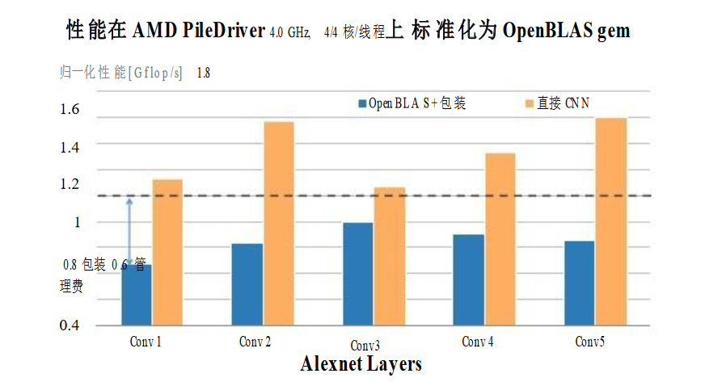
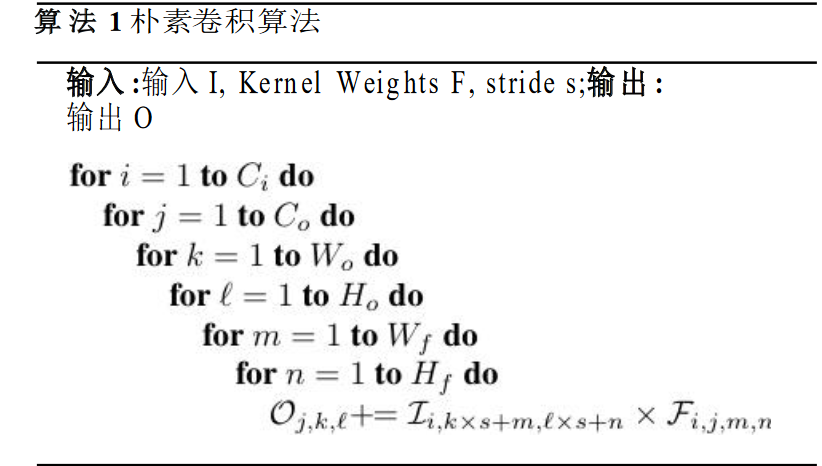
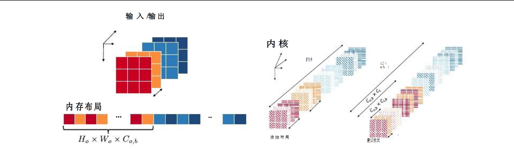
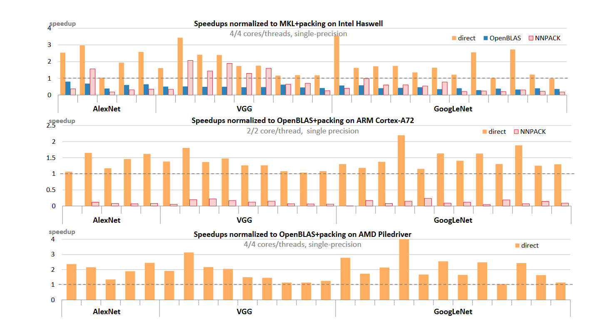
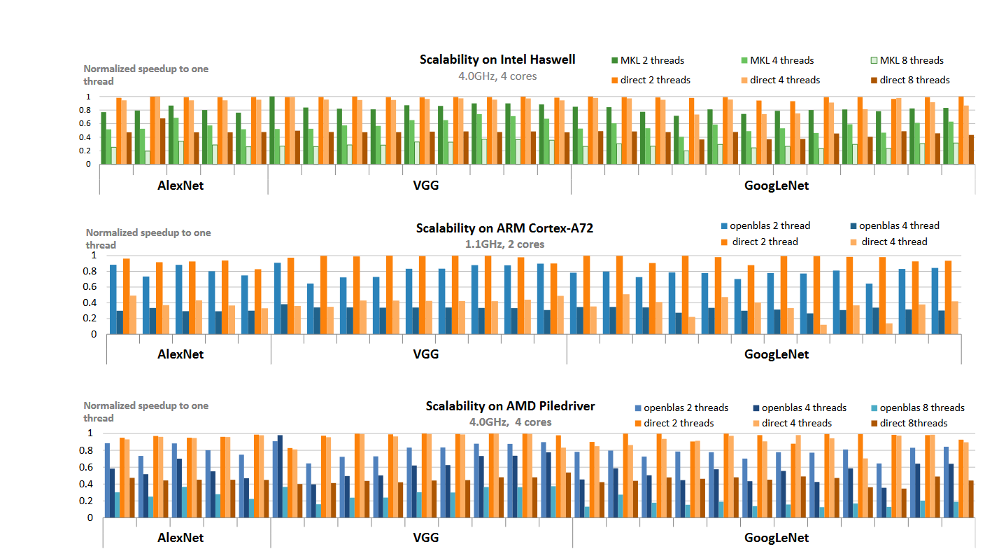

Week3-论文

# 高性能零内存开销直接卷积

## 摘要

深度神经网络中卷积层的计算通常需要使用额外的内存来提高性能，这种方法虽然提高了性能但是也存在一些问题。

存在的问题：

- 这些计算会产生额外的内存开销， 从而减少了网络的总体大小
- 没有针对执行卷积进行优化，意味着获得的性能会低于传统预期

​		本文主要证明==当我们正确的实现了高性能零内存开销直接卷积能够消除所有的内存开销，并且产生的性能比传统和嵌入式CPU架构卷积层现有的高性能实现高出10%-400%。==并且增加线程的数量时，高性能的直接卷积表现出更好的扩展性能。

---

---

## 1. 介绍

​			传统的直接卷积计算深度学习网络中的卷积层效率不高，现在很多的计算卷积层的方法都依赖基本线性代数子程序，如矩阵乘法，但是为了利用矩阵乘法，不得不去选择性的复制原始输入数据（统称为打包[^1]），从而产生额外的内存空间来提高性能。

这种方法存在两个问题：

- 对输入数据的重塑和复制会对整体系统性能产生额外的，不可忽略的时间损失。
- 由卷积层产生的矩阵通常与传统高性能计算（HPC)应用程序产生的矩阵维度不同，因此在矩阵乘法上矩阵进行卷积运算的性能没有那么好。

纵坐标：浮点运算次数（性能）

横坐标：卷积层

蓝色：OpenBLAS + Packing 

黄色：本文提到的高性能直接卷积实现

虚线：矩阵-矩阵乘法所获得的性能

从图中得到信息：

1. 本文提到的算法性能比矩阵-矩阵乘法的性能高出很多。
2. 由于实现矩阵乘法需要额外的包装步骤，因此实际上达到的效率不到矩阵乘法应有效率的80%

本文实现的直接卷积算法产生的性能高于使用矩阵乘法，并且没有使用任何的额外内存开销。

​			由于基于深度神经网络学习任务越来越多的放置在边缘设备[^2]中，这些设备在计算能力和内存容量方面收到限制。这意味着对于使用额外的内存来换取性能对这些设备来说不是可行的解决方案。

​			本文的实现的方法有：

- 高性能的直接卷积： 本文展示了直接卷积的性能、并行性、 和减少内存开销方面优于现存的基于矩阵-矩阵乘法的卷积，从而证明直接卷积是计算卷积层的一种可行的方法。
- 输入/输出特征张量和卷积核权重的数据布局： 提出了新的数据布局用于存储直接卷积算法计算卷积层所需要的输入、输出和卷积核权重。这些新数据的布局所需的空间与现有的数据存储方案相同，用于在任何打包或重复元素之前存储输入、输出和卷积核权重 。

---

##  2. 非直接卷积的低效性

### 2.1 基于快速傅立叶变换的实现

​	基于快速傅立叶变换的实现被作为在频域计算卷积时减少浮点运算次数的一种手段，但是为了使计算进行，必须要把卷积核大小填充到输入图像的大小，这样就产生了很多额外的内存，如果卷积核很小，产生的内存将会更多。

​	存在一种替代方法，将输入图像分为更小的块，但是这样也需要将内核权重重新额外填充到一个方便的大小提升性能，通过动态执行FFT来最小化这种额外的填充和将核转移到频域[^3]上。 这种方法可以显著的减少性能开销，特别是在嵌入式的设备上。

### 2.2 基于矩阵乘法的实现

​	这种方法是将输入图像和卷积核转化为矩阵，利用BLAS中高性能矩阵-矩阵乘法进行计算。

问题：

- 额外的内存需求，将图像转化为矩阵需要进行降维操作，通常使用im2col来进行操作，在降维的过程中，有些元素也会被复制，所需要的内存呈二次增长。Cho 和 Brand 提出了一种替代的降低机制，通过减少包装过程中所需要的重复量来提高内存效率。内存占比比im2col平均减少3.2倍，但是这仍然需要额外内存开销。并且它们的计算依赖矩阵-矩阵乘法。
- 次优矩阵-矩阵乘法：当输入矩阵的**内部维数**（通道数）小于**输出矩阵的整体维数**性能最佳。这种特殊的矩阵形状集合常见于科学和工程代码中。但是 im2col将输入张量变换为（$H_0 * W_{of} * C_i) * (H*W)$​矩阵，意味着输入矩阵的内部维度为两者最大的一个，因此在这组特定的形状的矩阵上的性能明显低于可实现的最佳性能。因此需要追求可以替代矩阵乘法的算法。并且现有的BLAS库中的并行性是通过划分输入矩阵的行和列来划分，他对矩阵进行的分块使得矩阵的形状偏离了矩阵乘法程序所期望的形状，因此，随着线程的数量增加，程序的效率会受到影响。

## 3. 高性能直接卷积

### 3.1 将循环映射到架构的策略

#### 3.1.1 模型架构

- 向量寄存器：可以存储多个数据，一个指令中含有多个数据，可以进行并行运算，多个数据同时计算。
- FMA指令：  是一种计算指令，融合了乘法和加法的计算，可以加速矩阵运算。优点是将加法和乘法合并成一个指令，从而减少指令的数量和计算的时间。
- Load/Store架构 ：Load/Store架构是指一种计算机架构，它用于处理模型中的参数加载和存储操作。该架构通常由两部分组成：Load单元和Store单元。Load单元负责从内存中加载参数到模型中，而Store单元负责将模型中的参数存储回内存中。一个好的Load/Store架构应该能够最大限度地减少参数加载和存储的时间和能耗，从而提高模型的训练和推理速度。

#### 3.1.2 ？ 循环饱和计算

​	当所有的Nfma[^4]单元每个周期计算一个FMA时，此时模型架构的最大性能得到实现。由于每个FMA指令都存在延迟，这意味着每个计算单元至少必须发出Lfma个独立的FMA指令。

#### 3.1.3 用循环优化数据重用

通过改变循环顺序来优化程序。

#### 3.1.4 内存层次的阻塞

1. 注册阻塞： 计算机中寄存器的数量是有上限的，因此意味着数据在寄存器中的保留是有限制的。为了避免降低性能的寄存器溢出，可以适当改变for循环的顺序。改变死循环顺序可以促进并行化。
2. 缓存阻塞： 在内存层次结构中具有更多级别的架构中，通常都会具有缓存的架构，通过进一步的调整循环的顺序可以适当的避免缓存阻塞。

### 3.2 并行性

由于输出的元素是三维对象，因此这意味着我们可以在三个不同的维度提取并行性。

## 4. 卷积友好的数据布局

本文的高性能直接卷积为输入和卷积核数据提供了新的数据布局，尽可能的以单位跨步访问数据。避免了访问数据从内存级别较低存储单元到访问内存中级别较高存储单元中代价高昂的停顿。修改布局的关键是确保输出和输入图像的数据布局相同，因为上一层卷积层的输出往往是下一层卷积层的输入。

### 输入/输出布局和卷集合的布局

## 5. 测试结果

​		架构选择选择了传统的CPU架构，将本文直接卷积的实现与基于矩阵乘法的卷积（链接到高性能BLAS库）进行比较。对于基于矩阵乘法的卷积，输入张量首先使用im2col程序打包成适当的矩阵，然后调用高性能的单精度矩阵乘法程序。

由图中可以知道，直接卷积的性能与基于 FFT（快速傅立叶变换）和 SGEMM（单精度通用矩阵乘法）卷积技术的现有高性能实现进行了比较。可以看出直接卷积与其他实现相比有很大的竞争力，即使与专门针对卷积层中的矩阵库相比，也能实现10%-400%的性能。

由图中得知随着线程数量的增加而扩展行为。当我们将线程数量从1增加到可用核心数量时，本文实现的直接卷积实现保留了每个核心的高 GFLOPs， 这表明这是一种高度的并行化算法。

## 心得

​		在读完这篇论文后，我了解了一种改进的直接卷积算法，它不需要利用额外的内存去换取性能的提升，并且产生的性能比传统和嵌入式CPU架构卷积层现有的高性能实现高出10%-400%。增加线程的数量时，高性能的直接卷积表现出更好的扩展性能。我之前了解过的基于矩阵乘法实现的卷积层算法，首先都需要通过打包的方式将输入的数据变为适合矩阵乘法的数据样式，首先变换需要耗费多于的时间，并且也需要多于的空间。无论是那种非直接卷积算法都会存在一些弊端，基于快速傅里叶变换需要填充卷积核图像的大小，如果存在多个卷积核，并且卷积核很小的情况下，这个时候就需要浪费很多的多于空间来填充数据，虽然出现了改进的最小化填充，但是相比较一些内存有限的边缘性设备来说，还是需要占比很大的空间。另一种算法是基于矩阵-矩阵乘法的实现，这个就需要将输入图像变换为适合矩阵乘法的矩阵例如常见的im2col算法，就是将输入图像降维成矩阵，这需要额外的内存消耗，并且有些元素也会被复制，所需要的内存呈二次增长。第一周阅读的im2win方法可以减少很多重复的元素，但是还是会存在一些内存的消耗，相比起im2col，效率提高了很多。还有一个问题就是只有当输入矩阵的内部维数（通道数）小于输出矩阵的整体维数性能才能达到最佳。而这种情况多数存在于科学和工程代码中。

​	然后就是了解了高性能直接卷积算法，首先就是将循环映射到架构的策略，我所理解的是：在现在CPU内存中，分为很多个存储部件，有寄存器，cache, 内存。 cache也会分为很多等级，这些部件的存储大小和读取速度都不一样，一般来说存储大小和读取速度成反比，即存储越大，读取速度越慢。当我们实现循环时，根据数据的存储位置和硬件特性，因为不管几层for循环他们的顺序怎么变化，出来的结果都是一样的。因此需要根据硬件的不同，和数据存储位置的不同去适当的调整循环的结构，可以优化算法，提高算法的时间，在之前阅读的im2win中也有提到过调整循环结构来优化算法。之前本科期间了解的优化算法中，大部分是利用空间去换取时间的优化，这种方法在一些内存空间有限的设备中应用具有很大的局限性，高性能计算应该更好去了解硬件的特性，从而结合软硬件去优化算法。现在的CPU大部分都存在多个核，也就是具有多个逻辑运算单元，能够很好的利用多核CPU的并行性也能够在很大程度上提升算法的性能。高性能零内存直接卷积通过改变输入输出卷积核的数据布局去实现算法的并行性，从测试结果可以知道这种方法的性能优于现存的非直接卷积性的一些算法。

​		通过这两篇论文我了解到现在存在的主流的卷积层的算法有直接卷积算法和基于矩阵-矩阵乘法算法，这两篇论文在现存算法的基础上提出了很好的优化方案，之前了解的直接卷积算法的弊端是计算效率较低，并且难以利用现代 CPU 或 GPU的并行计算能力，在性能和并行计算方面存在很大的局限性。而本篇论文则通过改变输入输出和卷积核布局去更好的利用CPU的并行计算能力。虽说本篇论文没有给出在GPU上的具体实现，但是这个算法应该可以在GPU上实现。然后im2win是在基于矩阵-矩阵乘法上改进，相比起im2col使用了更少的内存，并且减少了重复元素的数量。今后的学习不止需要学习软件上编程的知识，还应该去了解硬件的特性。

[^1]: 选择性的重塑和复制原始输入数据 
[^2]:是向企业或服务提供商核心网络提供入口点的设备。它们例如：路由器，路由交换机，各种城域网等。
[^3]:频域通常指的是将数据从时域（时间域）转换为频域（频率域）的过程,在频域中，数据可以表示为一组频率分量，这些分量可以用于分析和处理数据，
[^4]: Nfma单元是指"Non-Fused Multiply-Add"单元，它是一种计算机硬件加速器，用于执行深度学习中的矩阵乘法和加法运算。与传统的乘加单元不同，Nfma单元可以在一次操作中同时执行乘法和加法，从而提高计算效率。

遇到的问题：

FFT中的频域指的是什么？

算法一中的卷积核为什么有4个维度？