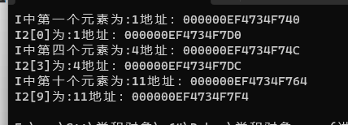
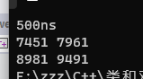
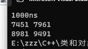
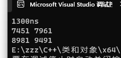
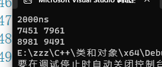
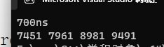
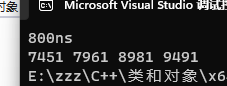
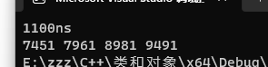
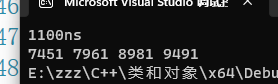

# week-2小作业补充

## 1. 一维数组和四维数组存放位置

```c++
// 四维数组
int I[1][3][3][3] =
	{
		{
			{{1,2,3},{4,5,6},{7,8,9}},
			{{11,12,13},{14,15,16},{17,18,19}},
			{{21,22,23},{24,25,26},{27,28,29}}
		}
	};
// 一维数组
int I2[27] = { 1,2,3,4,5,6,7,8,9,11,12,13,14,15,16,17,18,19,21,22,23,24,25,26,27,28,29 };
```

输出他们对应维度元素的地址：

```c++
cout << "I中第一个元素为:" << I[0][0][0][0] <<"地址："<< & I[0][0][0][0] << endl;
cout << "I2[0]为:" << I2[0] << "地址："<< &I2[0] << endl;
cout << "I中第四个元素为:" << I[0][0][1][0] << "地址：" << &I[0][0][1][0] << endl;
cout << "I2[3]为:" << I2[3] << "地址：" << &I2[3] << endl;
cout << "I中第十个元素为:" << I[0][1][0][0] << "地址：" << &I[0][1][0][0] << endl;
cout << "I2[9]为:" << I2[9] << "地址：" << &I2[9] << endl;
```


输出结果：



分析： 在四维数组中第二维度的第一个元素为4，地址与第一个元素地址差为12个字节，int类型为4个字节，说明二维中的物理地址是连续的。第三个维度的第一个元素与首地址差为36个字节，相差9个元素，说明元素之间的地址也是连续的。和一维数组地址摆放的位置一致。


## 2. 转换维度相乘

### 2.1 维度：4 * 4 = 4

```c++
for (int i = 0; i <= No - 1; i++)
	for (int j = 0; j <= Co - 1; j++)
		for (int m = 0; m <= Ho - 1; m++)
			for (int n = 0; n <= Wo - 1; n++)
				for (int r = 0; r <= Cf - 1; r++)
					for (int u = 0; u <= Hf - 1; u++)
						for (int v = 0; v <= Wf - 1; v++) 
							O[i][j][m][n] += I[i][r][m + u][n + v] * F[j][r][u][v];
							
				
```

输出张量和使用时间：




### 2.2 维度1 * 4 = 4

```c++
for (int i = 0; i <= No - 1; i++)
	for (int j = 0; j <= Co - 1; j++)
		for (int m = 0; m <= Ho - 1; m++)
			for (int n = 0; n <= Wo - 1; n++)
				for (int r = 0; r <= Cf - 1; r++)
					for (int u = 0; u <= Hf - 1; u++)
						for (int v = 0; v <= Wf - 1; v++) 
							O[i][j][m][n] += I2[27*i+9*r+(m+u)*3+n+v] * F[j][r][u][v];
							
				
```

输出




### 2.3 维度 4 * 1 = 4

```c++
O[i][j][m][n] += I[i][r][m + u][n + v] * F2[j*12+r*4+u*2+v];
```

输出



### 2.4 维度 1 * 1 = 4

```c++
O[i][j][m][n] += I2[27 * i + 9 * r + (m + u) * 3 + n + v] * F2[j * 12 + r * 4 + u * 2 + v];
```



### 2.5 维度 4 * 4 = 1

```c++
O2[4*i+4*j+2*m+n] += I[i][r][m + u][n + v] * F[j][r][u][v];
```



### 2.6 维度 1 * 4 = 1

```c++
O2[4 * i + 4 * j + 2 * m + n] += I2[27 * i + 9 * r + (m + u) * 3 + n + v] * F[j][r][u][v];
```



### 2.7 维度 4 * 1 = 1

```c++
O2[4 * i + 4 * j + 2 * m + n] += I[i][r][m + u][n + v] * F2[j * 12 + r * 4 + u * 2 + v];
```





### 2.8 维度 1 * 1 = 1

```c++
O2[4 * i + 4 * j + 2 * m + n] += I2[27 * i + 9 * r + (m + u) * 3 + n + v] * F2[j * 12 + r * 4 + u * 2 + v];
```


### 


## 3. 结论

四维张量转化为一维数组去做卷积操作，所需要的时间会更长，原因是一维数组选取值的时候会进行额外的运算，从而需要花费更多的时间，一维数组和四维张量所用的连续内存空间相同，对于运算来说，使用四维数组做运算的时间更短。