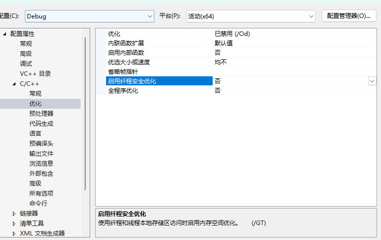
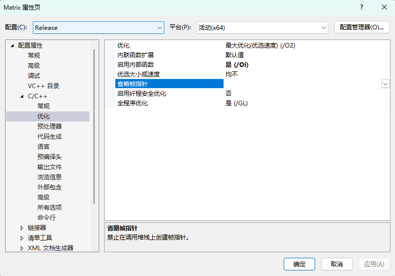
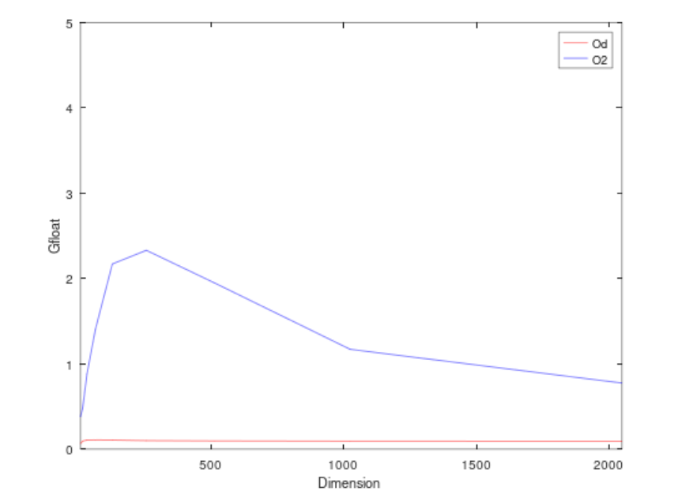
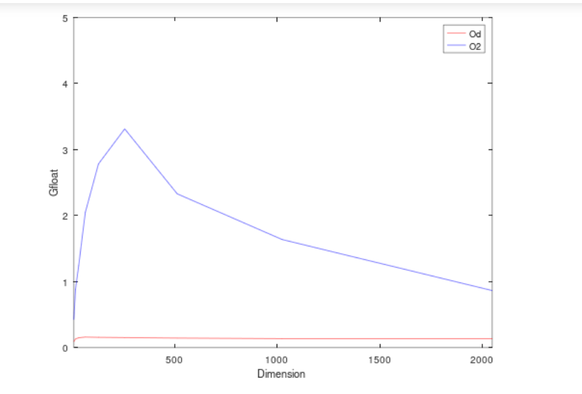
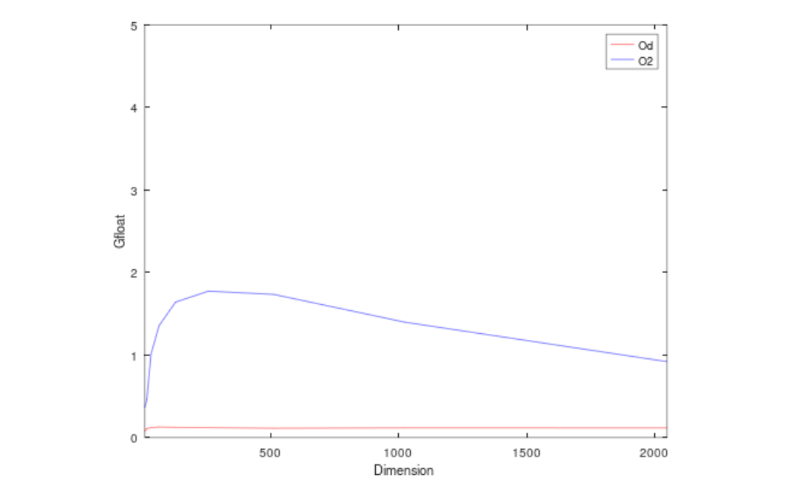
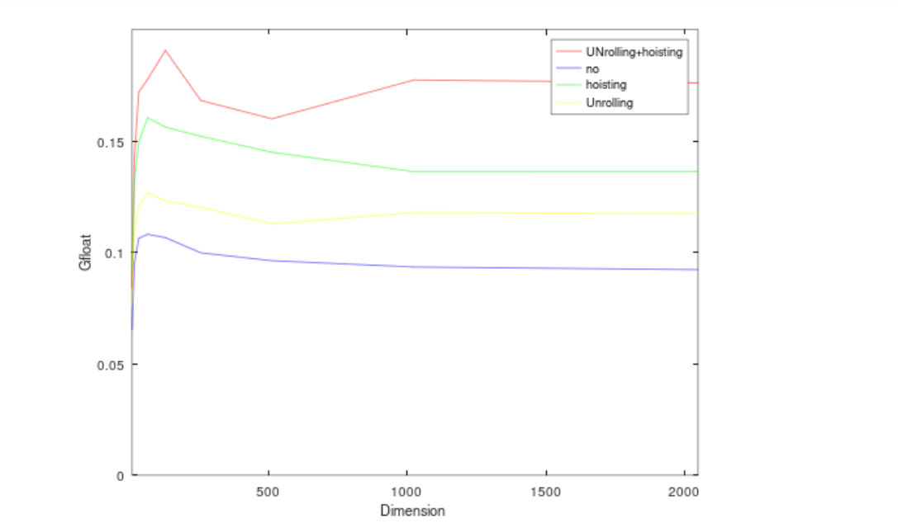
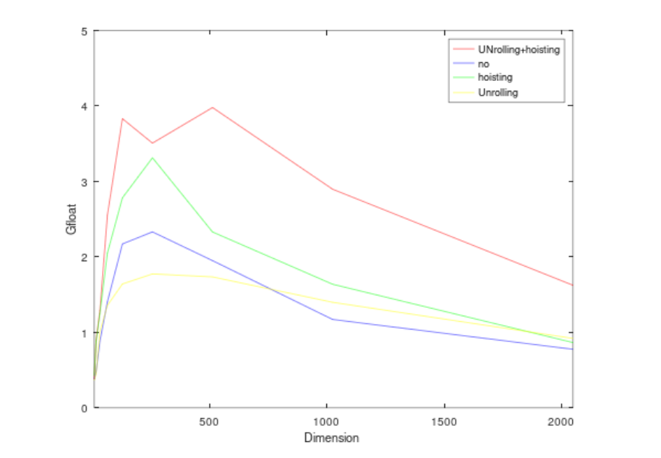

# 矩阵优化性能测试

## 1. 实验步骤

分别测试了在不同算法下，矩阵单位时间内浮点运算次数。

矩阵维度有8，16，32，64, 128，256,512,1024,2048 

分别在优化环境为不使用Od和最大优化O2条件下的计算次数

优化环境Od



优化环境O2



## 2. 实验数据

运算次数分别为：

| 8    | 16   | 32   | 64   | 128  | 256  | 512  | 1024 | 2048 |
| ---- | ---- | ---- | ---- | ---- | ---- | ---- | ---- | ---- |
| 2^10 | 2^13 | 2^16 | 2^19 | 2^22 | 2^25 | 2^28 | 2^31 | 2^34 |

### 2.1 普通矩阵测试

```c++
Matrix operator*(Matrix A) {
		if (this->m_column != A.getMRow()) {
			std::cout << "格式错误：无法相乘" << std::endl;
		}
		int C_row = this->m_row;
		int C_column = A.getMColumn();
		Matrix C(C_row, C_column);
		C.initMatrix();
		for (int i = 0; i < C_row; ++i) {
			for (int j = 0; j < C_column; ++j) {
				for (int k = 0; k < A.getMRow(); ++k) {
					C.getMData()[i].getVData()[j] += this->m_data[i][k] * A.getMData()[k][j];
				}
			}
		}
		return C;
	}
```

| xx   | 8      | 16     | 32     | 64     | 128     | 256     | 512     | 1024    | 2048    |
| ---- | ------ | ------ | ------ | ------ | ------- | ------- | ------- | ------- | ------- |
| Od   | 0.0157 | 0.0864 | 0.6164 | 4.849  | 39.3404 | 336.296 | 2788.84 | 22983   | 186247  |
| O2   | 0.0027 | 0.0171 | 0.0748 | 0.3734 | 1.9314  | 14.3936 | 137.646 | 1834.74 | 22157.3 |

时间单位为ms



### 2.2 hoisting优化后

```c++
Matrix operator*(Matrix A) {
		if (this->m_column != A.getMRow()) {
			std::cout << "格式错误：无法相乘" << std::endl;
		}
		int C_row = this->m_row;
		int C_column = A.getMColumn();
		Matrix C(C_row, C_column);
		for (int i = 0; i < C_row; ++i) {
			for (int j = 0; j < C_column; ++j) {
				int t = 0;
				for (int k = 0; k < A.getMRow(); ++k) {
					t += this->m_data[i][k] * A.getMData()[k][j];
				}
				C.getMData()[i].getVData()[j] = t;
			}
		}
		return C;
	}
```

| xx   | 8      | 16     | 32     | 64     | 128     | 256     | 512     | 1024    | 2048    |
| ---- | ------ | ------ | ------ | ------ | ------- | ------- | ------- | ------- | ------- |
| Od   | 0.0122 | 0.0622 | 0.4386 | 3.2678 | 26.8506 | 220.632 | 1852.71 | 15765.3 | 126070  |
| O2   | 0.0024 | 0.0093 | 0.0525 | 0.2559 | 1.5074  | 10.1268 | 115.212 | 1311.85 | 19874.4 |

时间单位为ms



### 2.3 Unrolling 优化后

| xx   | 8      | 16     | 32     | 64     | 128     | 256     | 512     | 1024    | 2048    |
| ---- | ------ | ------ | ------ | ------ | ------- | ------- | ------- | ------- | ------- |
| Od   | 0.0134 | 0.0756 | 0.5438 | 4.1411 | 34.0609 | 279.087 | 2379.42 | 18228   | 146301  |
| O2   | 0.0028 | 0.0181 | 0.0651 | 0.3864 | 2.5566  | 18.9148 | 154.762 | 1536.34 | 18681.6 |

时间单位为ms




### 2.4  UNrolling+hoisting

```c++
Matrix operator*(Matrix A) {
	if (this->m_column != A.getMRow()) {
		std::cout << "格式错误：无法相乘" << std::endl;
	}
	int C_row = this->m_row;
	int C_column = A.getMColumn();
	Matrix C(C_row, C_column);
	C.initMatrix();
	for (int i = 0; i < C_row; i += 2) {
		for (int j = 0; j < C_column; j += 2) {
			int t00 = C.getMData()[i][j];
			int t01 = C.getMData()[i][j + 1];
			int t10 = C.getMData()[i + 1][j];
			int t11 = C.getMData()[i + 1][j + 1];

			for (int k = 0; k < A.getMRow(); ++k) {
				t00 += this->m_data[i][k] * A.getMData()[k][j];
				t01 += this->m_data[i][k] * A.getMData()[k][j + 1];
				t10 += this->m_data[i + 1][k] * A.getMData()[k][j];
				t11 += this->m_data[i + 1][k] * A.getMData()[k][j + 1];
			}
			C.getMData()[i].getVData()[j] = t00;
			C.getMData()[i].getVData()[j + 1] = t01;
			C.getMData()[i + 1].getVData()[j] = t10;
			C.getMData()[i + 1].getVData()[j + 1] = t11;
		}
	}
	return C;
}
```

| xx   | 8         | 16     | 32     | 64     | 128    | 256     | 512     | 1024    | 2048    |
| ---- | --------- | ------ | ------ | ------ | ------ | ------- | ------- | ------- | ------- |
| Od   | 0.0122    | 0.0577 | 0.3812 | 2.9516 | 22.007 | 199.606 | 1678.51 | 12109   | 97592.1 |
| O2   | 2.7*e(-3) | 0.0091 | 0.051  | 0.2054 | 1.0947 | 9.5663  | 67.4625 | 741.485 | 10579   |

时间单位为ms


### 2.5 在od条件下，4种算法实现的GFloat对比




### 2.6 优化后，4种算法实现的GFloat对比




## 3. 实验结论

使用同一种的算法情况下，设置优化时的编译器计算速度远远大于未优化的时的计算速度。

根据算法的不同得到计算速度：未优化<Unrolling优化<hoisting 优化< Unrolling+hoisting优化