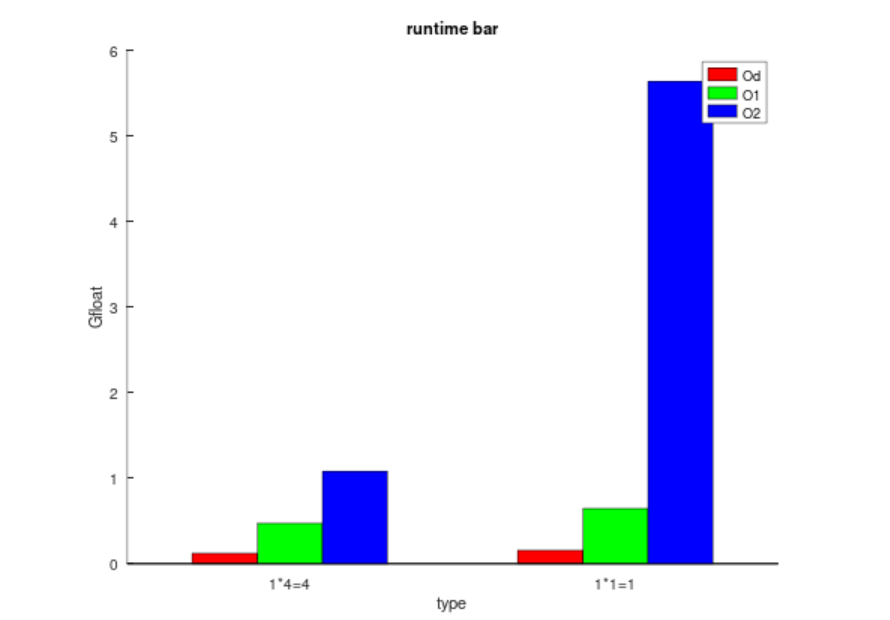

## 1.矩阵优化

补充

A:普通矩阵乘法

B: hoisting优化后的

C: unrolling优化后的

D: hoisting+unrolling优化后

单位 ms

| x       | 8      | 16     | 32     | 64     | 128     | 256     | 512     | 1024    | 2048    |
| ------- | ------ | ------ | ------ | ------ | ------- | ------- | ------- | ------- | ------- |
| A (/Od) | 0.0063 | 0.0368 | 0.2484 | 1.8648 | 18.9609 | 125.859 | 1223.64 | 8837.37 | 109680  |
| A (/O2) | 0.0028 | 0.0201 | 0.0856 | 0.3843 | 1.9665  | 15.0319 | 142.741 | 2207.94 | 22547.8 |
| B(/Od)  | 0.0055 | 0.03   | 0.1938 | 1.4233 | 11.5991 | 103.78  | 863.178 | 7644.4  | 92883.7 |
| B(/O2)  | 0.0027 | 0.0108 | 0.0491 | 0.2678 | 1.6025  | 11.2336 | 122.49  | 2119.62 | 21355.5 |
| C(/Od)  | 0.0074 | 0.0325 | 0.2132 | 1.6313 | 14.761  | 112.759 | 1059.39 | 7232.98 | 73186.2 |
| C(/O2)  | 0.0027 | 0.0125 | 0.0634 | 0.4262 | 2.6761  | 20.321  | 168.562 | 1506.71 | 17490.7 |
| D(/Od)  | 0.005  | 0.0253 | 0.1882 | 1.0699 | 8.5557  | 69.6294 | 647.872 | 5335.38 | 65608.6 |
| D(/O2)  | 0.0026 | 0.0102 | 0.039  | 0.2098 | 1.1158  | 7.7046  | 74.0951 | 870.785 | 10519.3 |


---


---


| x       | 2^12    | 2^13        | 2^14        | 2^15 | 2^16 | 2^17 | 2^18 | 2^19 | 2^20 |
| ------- | ------- | ----------- | ----------- | ---- | ---- | ---- | ---- | ---- | ---- |
| A (/Od) | 893607  |             |             |      |      |      |      |      |      |
| A (/O2) | 207432  | 1.89803e+06 |             |      |      |      |      |      |      |
| B(/Od)  | 751807  |             |             |      |      |      |      |      |      |
| B(/O2)  | 179981  | 1.63062e+06 | 1.69753e+07 |      |      |      |      |      |      |
| C(/Od)  | 566221  |             |             |      |      |      |      |      |      |
| C(/O2)  | 151544  | 1.33585e+06 | 1.63277e+07 |      |      |      |      |      |      |
| D(/Od)  | 502052  |             |             |      |      |      |      |      |      |
| D(/O2)  | 93109.7 | 895460      | 9.55929e+6  |      |      |      |      |      |      |

四种矩阵乘法优化程度不同时的运行时分别比较


四种矩阵优化程度不同Gfloat分别比较


4种矩阵乘法在优化程度不同时运行时上的比较


4种矩阵乘法在优化程度不同时Gfloat上的比较


从图中可以得到,

- 首先优化O2肯定是比不优化时Od快很多的，并且Gfloat优化时的数据也比不优化高。

- 优化后的矩阵乘法效率比未优化的时候高，从运行时角度来看,运行时长,D<C<B<A,

在O2级别下从图中可以知道大概在3000-8000维度的时候满足运行时长,D<C<B<A,超过8000维后ABC差不多,D比较快。Gfloat在Od下时A<B<C<D,在O2下，在一定维度范围内满足Od的速度，超过一定维度后,ABC速度差不多小于D。

- 从所有图像中大致可以知道,不管是运行时或者Gfloat，或者不同优化等级,也或者不同矩阵优化,在运行的过程中都会有一个临界点,超过这个维度后GFloat下降幅度明显,或者运行时上升的明显,在运行时图中,超过这个临界点后运行时的增长斜率突然变大,在Gfloat中，GFloat值会下降。如果可以确定这个临界点,对于矩阵乘法的效率就会有很大提升。
- 从四种矩阵乘法的运行时中可以看出,图像增长有两个临界点,并且运行时的增长随着维度的提高成分段式线性增长。

## 2. i++和++i性能补充

### 2.1 比较不同基本类型 int32_t,int64_t,uint32_t,uint64_t,float,double i++和++i的性能。

1. 引入头文件cstdint 
   - int32_t: 带符号的32位整型
   - int64_t: 带符号的64位整型
   - uint32_t: 不带符号的32位整型
   - uint64_t : 不带符号的64位整型
   - float:  单精度浮点数 32位
   - double： 双精度浮点数64位

2. 通过不同数据类型定义i
3. 测试不同次数不同基本类型i++和++i需要的时间


**优化环境为（/Od) ：未采用优化**

单位为：ms

|          | int32_t | int64_t | uint32_t | uint64_t | float   | double  |
| -------- | ------- | ------- | -------- | -------- | ------- | ------- |
| 1ww ++i  | 98.2956 | 81.9819 | 99.4657  | 80.3648  | 174.853 | 174.634 |
| 1ww i++  | 103.895 | 115.793 | 103.573  | 108.839  | 187.004 | 184.264 |
| 2ww ++i  | 194.907 | 162.737 | 197.769  | 161.04   | 334.034 | 337.172 |
| 2ww i++  | 200.616 | 201.086 | 206.616  | 205.478  | 352.005 | 353.345 |
| 4ww ++i  | 352.979 | 295.263 | 358.723  | 295.57   | 660.377 | 664.655 |
| 4ww i++  | 375.142 | 378.985 | 382.841  | 382.251  | 692.819 | 698.097 |
| 6ww ++i  | 698.535 | 590.131 | 714.379  | 586.101  | 1320.17 | 1312.48 |
| 6ww i++  | 743.506 | 743.665 | 763.416  | 739.933  | 1384.72 | 1374.71 |
| 8ww ++i  | 1390.47 | 1183.24 | 1393.35  | 1174.51  | 2638.68 | 2625.27 |
| 8ww  i++ | 1486.72 | 1487.53 | 1495.89  | 1488.18  | 2750.78 | 2758.43 |


首先比较各个数据类型的i++和++i运行时


各数据类型长度不同时i++和++i的运行时


比较数据位相同数据类型不同之间i++和++i


由这三张数据图比较可以得到：

1. i++耗时大于++i
2. 整型和无符号整型数据位多的进行++i操作较快，其他情况则差不多
3. 同数据位浮点数i++或者++i耗时最久，无符号整型和整型速度差不多。


### 2.2 int,long,longlong,unsigned int ,unsigned long...区别

| 数据类型                                     | 所占字节 | 最小值 | 最大值 |
| -------------------------------------------- | -------- | ------ | ------ |
| int (整型)                                   | 4        | -2^31  | 2^31-1 |
| long(长整型)                                 | 4        | -2^31  | 2^31-1 |
| long long(长整型)                            | 8        | -2^63  | 2^63-1 |
| unsigned int(无符号整型)                     | 4        | 0      | 2^32-1 |
| unsigned long(无符号长整型)                  | 4        | 0      | 2^32-1 |
| unsigned long long(无符号长整型)             | 8        | 0      | 2^64-1 |
| int32_t (int类型的同义词)                    | 4        | -2^31  | 2^31-1 |
| int_64_t （longlong类型的同义词)             | 8        | -2^63  | 2^63-1 |
| uint32_t (无符号整型 ~ unsigned int)         | 4        | 0      | 2^32-1 |
| uint62_t (无符号长整型 ~ unsigned long long) | 8        | 0      | 2^64-1 |

- long和int区别：在32位操作系统上 long 4字节 Int4字节 

​							        在64位操作系统上 long: 8字节 int 4字节

- int和unsigned int区别： 一个代表有符号整数，整数值可以为负数（带符号）。另一个为无符号整数，整数只能为正。

- int32_t与int64_t:这些数据类型是大小相同的 ANSI 类型的同义词，用于编写在多个平台中具有相同行为的可移植代码。而 int32_t 是 int 类型的同义词。 int64_t类型是 long long 类型的同义词。

- int32_t与uint32_t: 类似于int和unsigned int.

---

---


## 3. 张量方向卷积驱动

### 3.1 编写四维数组张量类和一维数组张量类

四维张量类：

```c++
#include<iostream>
#include <vector>
#include<cstdlib>
#include<ctime>
using namespace std;

class Tensor
{
private:
	int N;
	int C;
	int H;
	int W;
	vector<vector<vector<vector<int>>>> a;
public:
	Tensor() {
		this->N = 0;
		this->C = 0;
		this->H = 0;
		this->W = 0;
		this->a.resize(0);
	}
	Tensor(int N,int C,int H,int W) {
		this->N = N;
		this->C = C;
		this->H = H;
		this->W = W;
		// 给四维数组分配空间
		this->a.resize(N);
		for (int i = 0; i < N; ++i) {
			this->a[i].resize(C);
			for (int j = 0; j < C; ++j) {
				this->a[i][j].resize(H);
				for (int k = 0; k < H; ++k) {
					this->a[i][j][k].resize(W);
				}
			}
		}

		// 初始化
		for (int i = 0; i < N; ++i) {
			for (int j = 0; j < C; ++j) {
				for (int k = 0; k < H; ++k) {
					for (int l = 0; l < W; ++l) {
						this->a[i][j][k][l] = 0;
					}
				}
			}
		}
		
	}
	// 随机赋值
	void randomAssign() {
		srand((int)time(0));
		// 给四维数组随机赋值
		for (int i = 0; i < N; ++i) {
			for (int j = 0; j < C; ++j) {
				for (int k = 0; k < H; ++k) {
					for (int l = 0; l < W; ++l) {
						this->a[i][j][k][l] = 1 + (int)(100.0 * rand() / (RAND_MAX + 1.0));
					}
				}
			}
		}
	}

	// 输出
	void printTensor() {
		for (int i = 0; i < N; ++i) {
			cout << "第" << i << "个三维数组：" << endl;
			for (int j = 0; j < C; ++j) {
				cout << "第" << j << "个矩阵："<< endl;
				for (int k = 0; k < H; ++k) {
					for (int l = 0; l < W; ++l) {
						cout << this->a[i][j][k][l] << " ";
					}
					cout << endl;
				}
			}
		}
	}
};


```

一维数组类：

```c++
#include <iostream>
#include <vector>
#include <ctime>
#include <cstdlib>
using namespace std;

class Tensor1
{
private:
	int N;
	int C;
	int H;
	int W;
	vector<int> a;
public:
	Tensor1() {
		this->N = 0;
		this->C = 0;
		this->H = 0;
		this->W = 0;
		this->a.resize(0);
	}
	Tensor1(int N, int C, int H, int W) {
		this->N = N;
		this->C = C;
		this->H = H;
		this->W = W;
		// 给一维数组分配空间
		this->a.resize(N * C * H * W);


		// 给一维数组赋值
		srand((int)time(0));
		for (int i = 0; i < N * C * H * W; ++i) {
			this->a[i] = 0;
		}
	}

	void randomAssign() {
		for (int i = 0; i < N * C * H * W; ++i) {
			this->a[i] = 1 + (int)(100.0 * rand() / (RAND_MAX + 1.0));
		}
	}

	void printTensor() {
		for (int i = 0; i < N; ++i) {
			cout << "第" << i << "个三维数组：" << endl;
			for (int j = 0; j < C; ++j) {
				cout << "第" << j << "个矩阵：" << endl;
				for (int k = 0; k < H; ++k) {
					for (int l = 0; l < W; ++l) {
						cout << this->a [i*(C*H*W) + j*(H*W) + k*(W) + l] << " ";
					}
					cout << endl;
				}
			}
		}
	}
};
```

### 3.2 卷积测试：

优化环境：/Od,/O1,/O2

步长：1

padding : 0(不填充)

输入张量：10 * 3 * 20* 20

卷积核： 5 * 3 * 5 * 5

输出张量： 10 * 5 * 16 * 16

总循环次数：10 * 5 * 16 * 16 * 3 * 5 * 5 = 960000

单个循环运算次数：  输入 * 卷积核 = 输出

时间单位：ms

| s              | 4 * 4 = 4  | 1 * 4 = 4  | 4 * 1 = 4  | 1 * 1 = 4  | 4 * 4 = 1  | 1 * 4 = 1  | 4 * 1 = 1  | 1 * 1 = 1  |
| -------------- | ---------- | ---------- | ---------- | ---------- | ---------- | ---------- | :--------: | ---------- |
| 循环           | 960000     | 960000     | 960000     | 960000     | 960000     | 960000     |   960000   | 960000     |
| 总：           | 1920000    | 1920000    | 1920000    | 1920000    | 1920000    | 1920000    |  1920000   | 1920000    |
| runtime（/Od): | 74378.1    | 10121.8    | 67146.2    | 15.6756    | 76340.8    | 10056.7    |  66528.4   | 12.2028    |
| Gfloat         | 2.5814e-05 | 1.8969e-04 | 2.8594e-05 | 1.2248e-01 | 2.5150e-05 | 1.9092e-04 | 2.8860e-05 | 1.5734e-01 |
| runtime（/O1): | 34985.2    | 4323.42    | 30259.3    | 4.0588     | 34090.5    | 4270.18    |   30348    | 2.9807     |
| Gfloat         | 5.4880e-05 | 4.4409e-04 | 6.3452e-05 | 4.7305e-01 | 5.6321e-05 | 4.4963e-04 | 6.3266e-05 | 6.4414e-01 |
| runtime（/O2): | 34710.8    | 4173.27    | 30014.3    | 1.7819     | 33230.9    | 4167.98    |  29640.3   | 0.3408     |
| Gfloat         | 5.5314e-05 | 4.6007e-04 | 6.3970e-05 | 1.0775     | 5.7778e-05 | 4.6065e-04 | 6.4777e-05 | 5.6338e+00 |

运行时柱状图：


Gfloat柱状图:




### 3.3 结论

一维比四维运行时少很多，张量越大，转化为一维卷积使用的时间越少。运算次数也更快。
