## 1.Conda 安装

1. 下载安装包

安装包地址：https://docs.conda.io/projects/conda/en/latest/user-guide/install/linux.html

---

2. 安装conda

在下载后的文件路径下运行   bash Anaconda3-2023.09-0-Linux-x86_64.sh

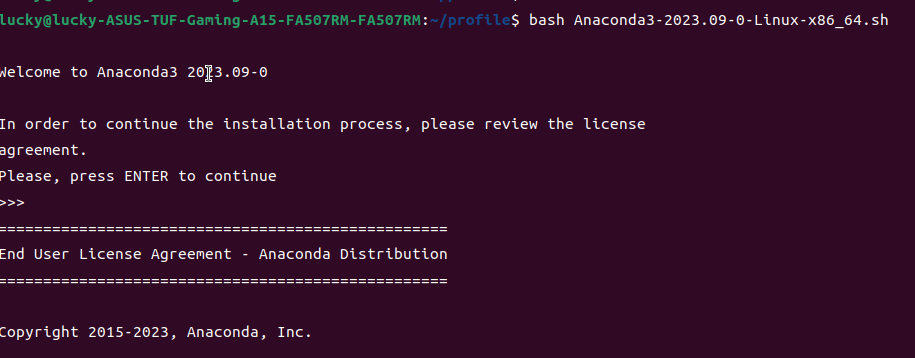

按enter建后可以阅读条款

 输入q退出 输入yes 

按下enter安装在默认路径


出现下面提示信息表示安装成功

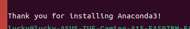

---


3. 验证是否安装成功

安装过程中会自己修改环境变量，这个时候只需要更新以下环境变量文件即可

输入source ~/.bashrc更新 

之后在输入conda验证是否安装成功

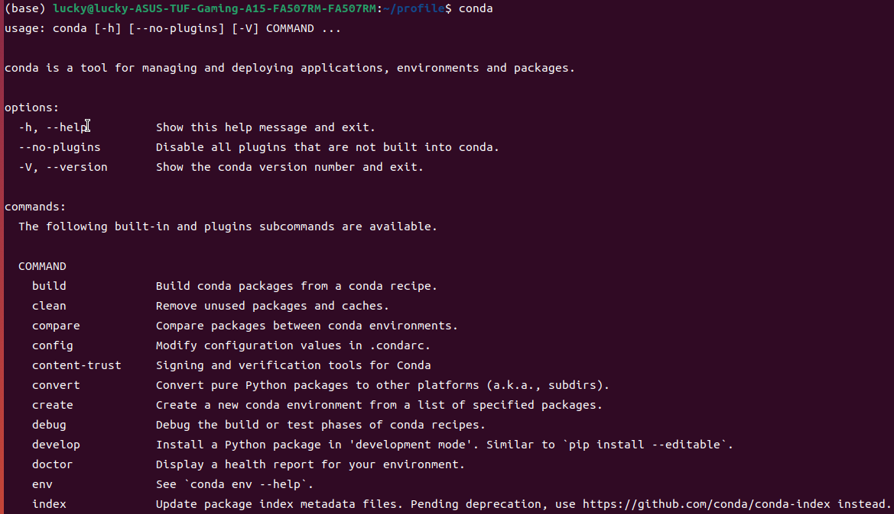

```shell
$ bash Anaconda3-2023.09-0-Linux-x86_64.sh
$ source ~/.bashrc
$ conda
```


## 2.配置libtorch环境

创建libtorch环境

```shell
$ conda create -n libtorch python=3.8
```

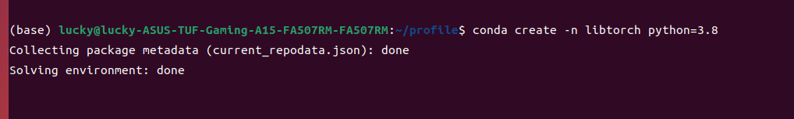

查看conda的环境列表

```shell
$ conda info --envs
```


进入libtorch环境

```shell
$ conda activate libtorch
```


安装依赖库

```shell
$ conda install astunparse numpy ninja pyyaml setuptools cmake cffi typing_extensions future six requests dataclasses
$ conda install mkl mkl-include
```

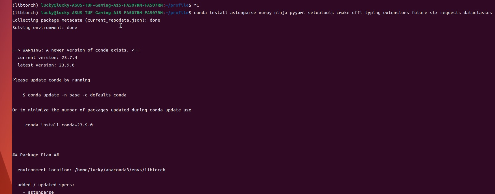

---


## 3. 编译pytorch

git clone pytorch

下载完后运行

```shell
(libtorch) $ cd pytorch
(libtorch) $ rm -rf build
(libtorch) $ mkdir build
(libtorch) $ cd build
```

错误步骤...

之后运行

```shell
(libtorch) $ cmake -G Ninja \
 -DUSE_CUDA=ON \
 -DUSE_CUDNN=ON \ # ON=CUDNN or OFF=CUBLAS
 -DUSE_NCCL=OFF \
 -DUSE_OPENMP=ON \
 -DUSE_XNNPACK=OFF \
 -DBUILD_CAFFE2=OFF \
 -DUSE_MKLDNN=OFF \
 -DUSE_FBGEMM=OFF \
 -DUSE_PYTORCH_QNNPACK=OFF \
 -DUSE_QNNPACK=OFF \
 -DUSE_KINETO=OFF \
 -DUSE_NNPACK=OFF \
 -DPYTHON_EXECUTABLE=~/anaconda3/envs/libtorch/bin/python \ # the Python executable you want to use
 -DBUILD_CAFFE2_OPS=OFF \
 -DBUILD_SHARED_LIBS:BOOL=ON \
 -DCMAKE_BUILD_TYPE:STRING=Debug \
 -DCMAKE_INSTALL_PREFIX:PATH=../libtorch
```

出现错误

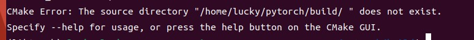

更改命令为(在cmake后面加上 .  )

```shell
(libtorch) $ cmake . -G Ninja \
 -DUSE_CUDA=ON \
 -DUSE_CUDNN=ON \ # ON=CUDNN or OFF=CUBLAS
 -DUSE_NCCL=OFF \
 -DUSE_OPENMP=ON \
 -DUSE_XNNPACK=OFF \
 -DBUILD_CAFFE2=OFF \
 -DUSE_MKLDNN=OFF \
 -DUSE_FBGEMM=OFF \
 -DUSE_PYTORCH_QNNPACK=OFF \
 -DUSE_QNNPACK=OFF \
 -DUSE_KINETO=OFF \
 -DUSE_NNPACK=OFF \
 -DPYTHON_EXECUTABLE=~/anaconda3/envs/libtorch/bin/python \ # the Python executable you want to use
 -DBUILD_CAFFE2_OPS=OFF \
 -DBUILD_SHARED_LIBS:BOOL=ON \
 -DCMAKE_BUILD_TYPE:STRING=Debug \
 -DCMAKE_INSTALL_PREFIX:PATH=../libtorch
```

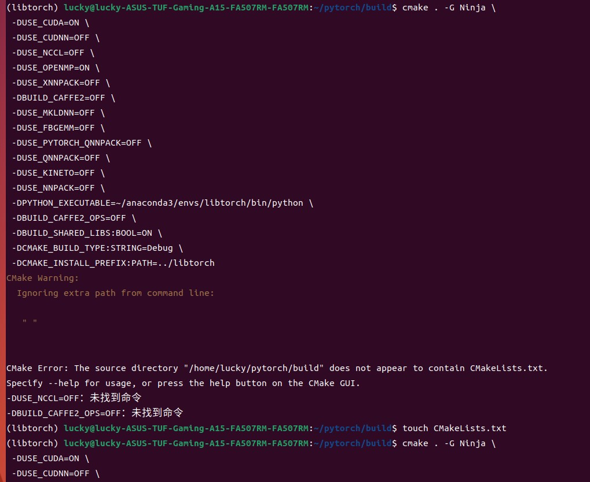

自己创建文件CMakeList.txt 加上内容

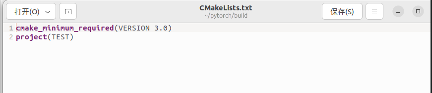

再次运行

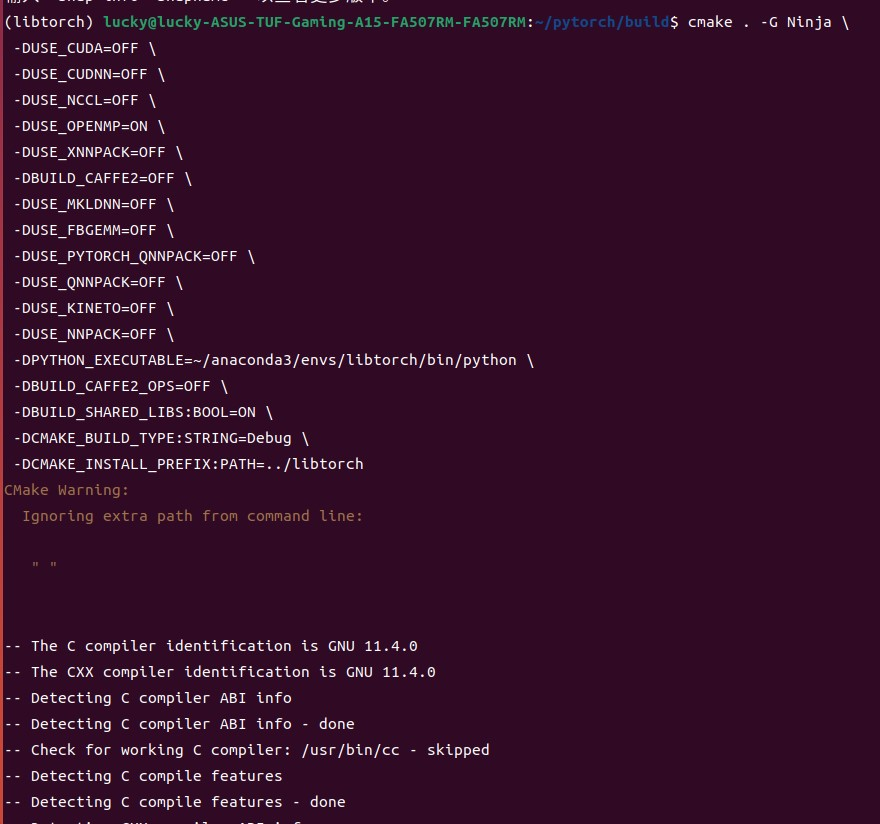

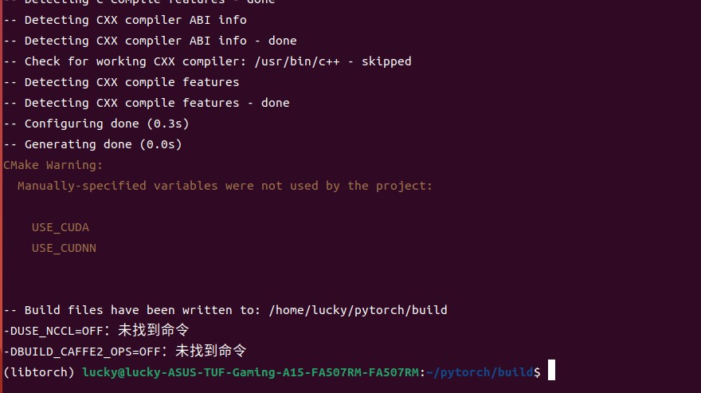

在输入

```shell
$ ninga install
```

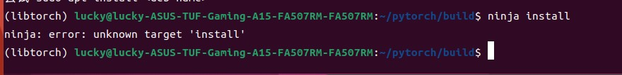

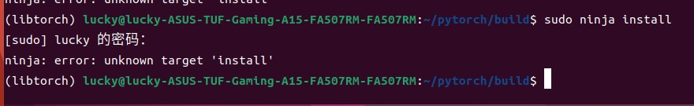


正确：

在build目录下

```shell
(libtorch) $ cmake .. -G Ninja \
 -DUSE_CUDA=ON \
 -DUSE_CUDNN=ON \ # ON=CUDNN or OFF=CUBLAS
 -DUSE_NCCL=OFF \
 -DUSE_OPENMP=ON \
 -DUSE_XNNPACK=OFF \
 -DBUILD_CAFFE2=OFF \
 -DUSE_MKLDNN=OFF \
 -DUSE_FBGEMM=OFF \
 -DUSE_PYTORCH_QNNPACK=OFF \
 -DUSE_QNNPACK=OFF \
 -DUSE_KINETO=OFF \
 -DUSE_NNPACK=OFF \
 -DPYTHON_EXECUTABLE=~/anaconda3/envs/libtorch/bin/python \ 
 -DBUILD_CAFFE2_OPS=OFF \
 -DBUILD_SHARED_LIBS:BOOL=ON \
 -DCMAKE_BUILD_TYPE:STRING=Debug \
 -DCMAKE_INSTALL_PREFIX:PATH=../libtorch
```

缺少子模块需要根据指定缺少的子模块去github去寻找github的源码然后一个一个git clone移到指定文件夹。

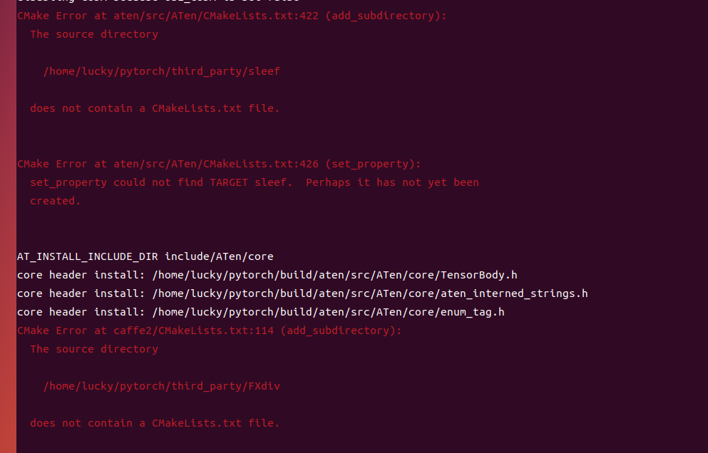

解决完子模块缺少的问题会出现无法找到python路径，这个时候需要修改路径为绝对路径

CMake Error at cmake/Dependencies.cmake:1034 (message): The Python executable ~/anaconda3/envs/libtorch/bin/python cannot be run. Make sure that it is an absolute path. Call Stack (most recent call first): CMakeLists.txt:722 (include)

```shell
-DPYTHON_EXECUTABLE=~/anaconda3/envs/libtorch/bin/python \ ==>
-DPYTHON_EXECUTABLE=home/yourname/anaconda3/envs/libtorch/bin/python \ 
```

目前还未解决的问题:

```shell
CMake Error:
Running

'/home/lucky/anaconda3/envs/libtorch/bin/ninja' '-C' '/home/lucky/pytorch/build' '-t' 'recompact'

failed with:

ninja: error: build.ninja:13056: multiple rules generate caffe2/CMakeFiles/torch_cpu.dir/__/aten/src/ATen/UfuncCPUKernel_add.cpp.DEFAULT.cpp.o [-w dupbuild=err]

```

