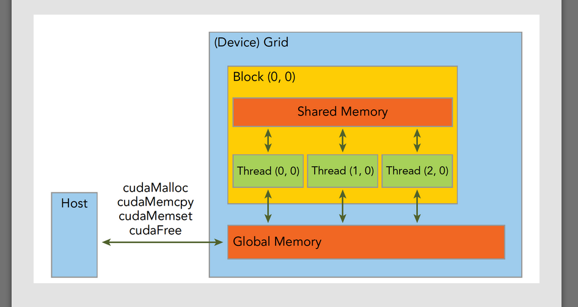
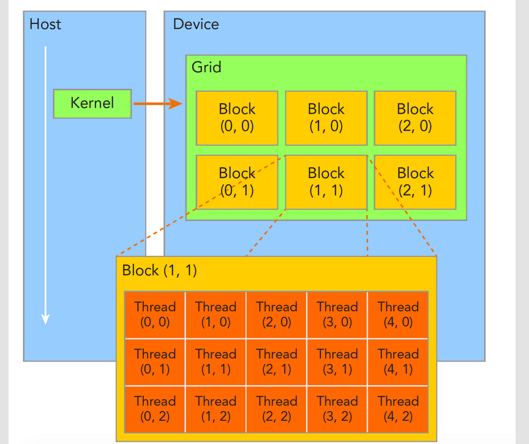
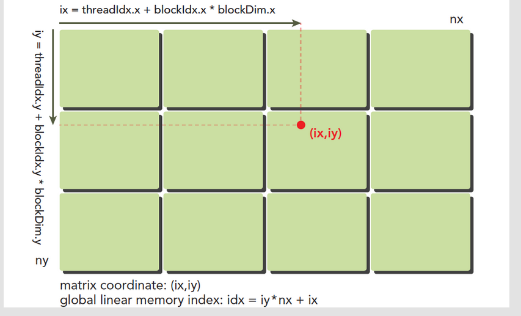
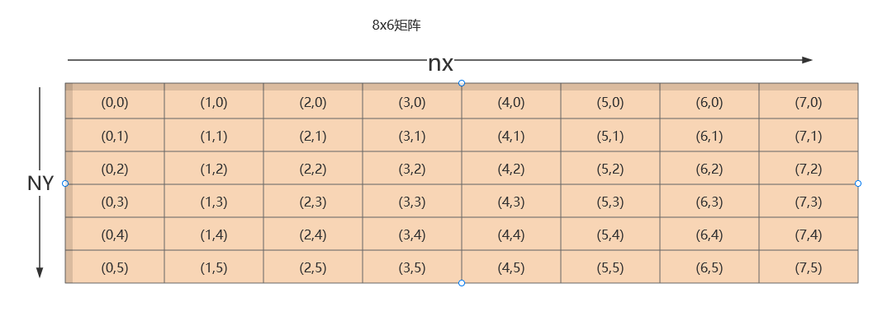
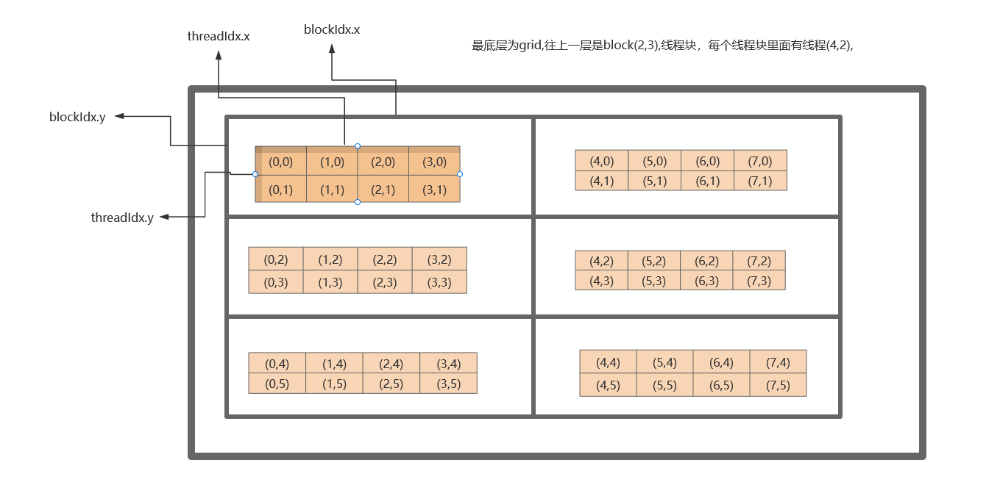
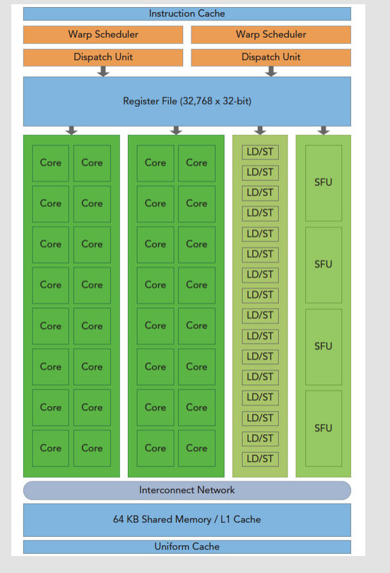
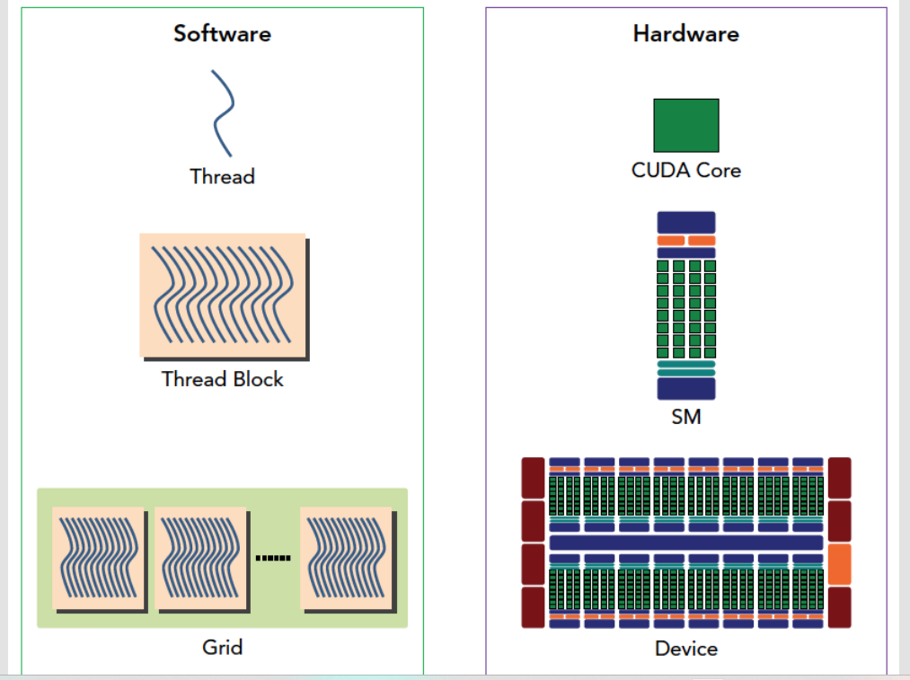
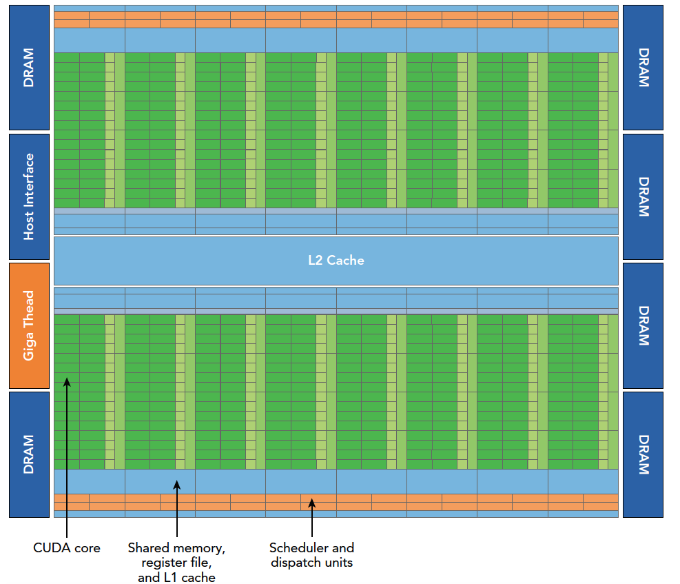
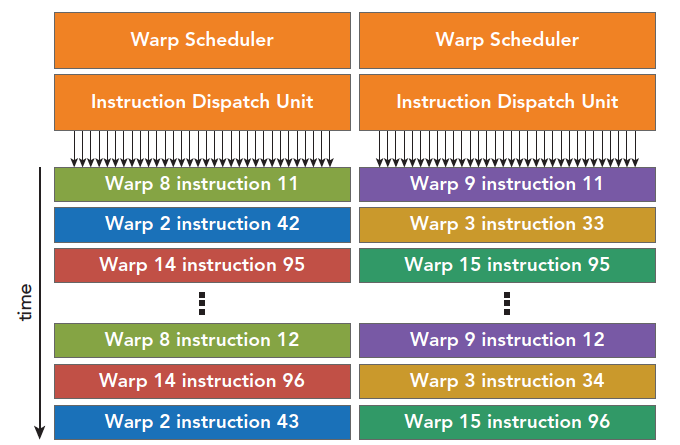

# cuda编程

---

## 异构计算与CUDA

cpu线程和GPU线程的区别

1. CPU线程是重量级实体，操作系统交替执行线程，线程上下文切换花销很大
2. GPU线程是轻量级的，GPU应用一般包含成千上万的线程，多数在排队状态，线程之间切换基本没有开销。
3. CPU的核被设计用来尽可能减少一个或两个线程运行时间的延迟，而GPU核则是大量线程，最大幅度提高吞吐量

helloworld

```c++
#include<stdio.h>
__global__ void hello_world(void)  // 是告诉编译器这个是个可以在设备上执行的核函数
{
  printf("GPU: Hello world!\n");
}
int main(int argc,char **argv)
{
  printf("CPU: Hello world!\n");
  hello_world<<<4,5>>>();  //这句话C语言中没有’<<<>>>’是对设备进行配置的参数，也是CUDA扩展出来的部分。代表4个线程块，里面有5个线程。
  cudaDeviceReset();//这句话如果没有，则不能正常的运行，因为这句话包含了隐式同步，GPU和CPU执行程序是异步的，核函数调用后成立刻会到主机线程继续，而不管GPU端核函数是否执行完毕，所以上面的程序就是GPU刚开始执行，CPU已经退出程序了，所以我们要等GPU执行完了，再退出主机线程。
  return 0;
}
// 输出结果
CPU: Hello world!
GPU: Hello world!
GPU: Hello world!
GPU: Hello world!
GPU: Hello world!
GPU: Hello world!
GPU: Hello world!
GPU: Hello world!
GPU: Hello world!
GPU: Hello world!
GPU: Hello world!
GPU: Hello world!
GPU: Hello world!
GPU: Hello world!
GPU: Hello world!
GPU: Hello world!
GPU: Hello world!
GPU: Hello world!
GPU: Hello world!
GPU: Hello world!
GPU: Hello world!

```

一般CUDA程序分成下面这些步骤：

1. 分配GPU内存
2. 拷贝内存到设备
3. 调用CUDA内核函数来执行计算
4. 把计算完成数据拷贝回主机端
5. 内存销毁

上面的hello world只到第三步，没有内存交换。


## CUDA编程模型概述（一）

GPU大致分为核函数，内存管理，线程管理，流等关键部分。

### 内存管理

内存管理在传统串行程序是非常常见的，寄存器空间，栈空间内的内存由机器自己管理，堆空间由用户控制分配和释放，CUDA程序同样，只是CUDA提供的API可以分配管理设备上的内存，当然也可以用CDUA管理主机上的内存，主机上的传统标准库也能完成主机内存管理。
内存分配：malloc --> cudaMalloc 

内存复制: memcpy --> cudaMemcpy 

内存设置: memset --> cudaMemset 

内存释放: free --> cudaFree

内存拷贝函数cudaMemcpy

```c++
cudaError_t cudaMemcpy(void * dst,const void * src,size_t count,cudaMemcpyKind kind)
```

cudaMemcpykind: 

- cudaMemcpyHostToHost
- cudaMemcpyHostToDevice
- cudaMemcpyDeviceToHost
- cudaMemcpyDeviceToDevice

```c++
char* cudaGetErrorString(cudaError_t error) //使用这个指令可以查看详细错误信息
```





### 线程管理

==一个核函数只能有一个grid，一个grid可以有很多个块，每个块可以有很多的线程==



一个线程块block中的线程可以完成下述协作：

- 同步
- 共享内存

不同块内线程不能相互影响！他们是物理隔离的！

线程位置

- blockIdx（线程块在线程网格内的位置索引）
- threadIdx（线程在线程块内的位置索引）

blockldx和threadIdx是一个uint3的结构体，包含blockIdx.x/y/z，三个参数，threadIdx也是一样。

- blockDim (线程的总大小)
- gridDim （线程块的总大小)

```c++
#include <cuda_runtime.h>
#include <stdio.h>
__global__ void checkIndex(void)
{
  printf("threadIdx:(%d,%d,%d) blockIdx:(%d,%d,%d) blockDim:(%d,%d,%d)\
  gridDim(%d,%d,%d)\n",threadIdx.x,threadIdx.y,threadIdx.z,
  blockIdx.x,blockIdx.y,blockIdx.z,blockDim.x,blockDim.y,blockDim.z,
  gridDim.x,gridDim.y,gridDim.z);
}
int main(int argc,char **argv)
{
  int nElem=6;
  dim3 block(3);  // block(3,1,1) 
  dim3 grid((nElem+block.x-1)/block.x); //grid(2,1,1)
  printf("grid.x %d grid.y %d grid.z %d\n",grid.x,grid.y,grid.z);
  printf("block.x %d block.y %d block.z %d\n",block.x,block.y,block.z);
  checkIndex<<<grid,block>>>();
  cudaDeviceReset();
  return 0;
}

```

输出结果

```shel
grid.x 2 grid.y 1 grid.z 1
block.x 3 block.y 1 block.z 1
threadIdx:(0,0,0) blockIdx:(1,0,0) blockDim:(3,1,1)  gridDim(2,1,1)
threadIdx:(1,0,0) blockIdx:(1,0,0) blockDim:(3,1,1)  gridDim(2,1,1)
threadIdx:(2,0,0) blockIdx:(1,0,0) blockDim:(3,1,1)  gridDim(2,1,1)
threadIdx:(0,0,0) blockIdx:(0,0,0) blockDim:(3,1,1)  gridDim(2,1,1)
threadIdx:(1,0,0) blockIdx:(0,0,0) blockDim:(3,1,1)  gridDim(2,1,1)
threadIdx:(2,0,0) blockIdx:(0,0,0) blockDim:(3,1,1)  gridDim(2,1,1)

```

```c++
#include <cuda_runtime.h>
#include <stdio.h>
int main(int argc,char ** argv)
{
  int nElem=1024;
  dim3 block(1024);
  dim3 grid((nElem-1)/block.x+1);
  printf("grid.x %d block.x %d\n",grid.x,block.x);

  block.x=512;
  grid.x=(nElem-1)/block.x+1;
  printf("grid.x %d block.x %d\n",grid.x,block.x);

  block.x=256;
  grid.x=(nElem-1)/block.x+1;
  printf("grid.x %d block.x %d\n",grid.x,block.x);

  block.x=128;
  grid.x=(nElem-1)/block.x+1;
  printf("grid.x %d block.x %d\n",grid.x,block.x);

  cudaDeviceReset();
  return 0;
}

```

```shel
grid.x 1 block.x 1024
grid.x 2 block.x 512
grid.x 4 block.x 256
grid.x 8 block.x 128
```

## CUDA编程模型概述（二）

核函数--> 1. 启动核函数 2. 编写核函数 3. 验证核函数 --> 错误处理

1. 启动核函数

CUDA:kernel_name<<<grid,block>>>(argument list); ==> C:function_name(argument list);

==当主机启动了核函数，控制权马上回到主机，而不是主机等待设备完成核函数的运行==

```c++
cudaError_t cudaDeviceSynchronize(void); // 该指令可以时主机等待核函数验证完
```

2. 编写核函数

```c++
__global__ void kernel_name(argument list);
```

| 限定符     | 执行       | 调用                                       | 备注                     |
| ---------- | ---------- | ------------------------------------------ | ------------------------ |
| __global__ | 设备端执行 | 可以从主机调用也可以从设备端以上的设备调用 | 必须有一个void的返回类型 |
| __device__ | 设备端执行 | 设备端调用                                 |                          |
| __host__   | 主机端执行 | 主机调用                                   | 可以省略                 |

核函数限制

1. 只能访问设备内存
2. 必须有void返回类型
3. 不支持可变数量的参数
4. 不支持静态变量
5. 显示异步行为

```c++
/*
* https://github.com/Tony-Tan/CUDA_Freshman
* 3_sum_arrays
*/
#include <cuda_runtime.h>
#include <stdio.h>
#include "freshman.h"


void sumArrays(float * a,float * b,float * res,const int size)
{
  for(int i=0;i<size;i+=4)
  {
    res[i]=a[i]+b[i];
    res[i+1]=a[i+1]+b[i+1];
    res[i+2]=a[i+2]+b[i+2];
    res[i+3]=a[i+3]+b[i+3];
  }
}
__global__ void sumArraysGPU(float*a,float*b,float*res)
{
  int i=threadIdx.x;
  res[i]=a[i]+b[i];
}
int main(int argc,char **argv)
{
  int dev = 0;
  cudaSetDevice(dev);

  int nElem=32;
  printf("Vector size:%d\n",nElem);
  int nByte=sizeof(float)*nElem;
  float *a_h=(float*)malloc(nByte);
  float *b_h=(float*)malloc(nByte);
  float *res_h=(float*)malloc(nByte);
  float *res_from_gpu_h=(float*)malloc(nByte);
  memset(res_h,0,nByte); // 赋值0 把res_h中nByte大小的数都赋值为0
  memset(res_from_gpu_h,0,nByte);

  float *a_d,*b_d,*res_d;
  CHECK(cudaMalloc((float**)&a_d,nByte));
  CHECK(cudaMalloc((float**)&b_d,nByte));
  CHECK(cudaMalloc((float**)&res_d,nByte));

  initialData(a_h,nElem);	// 随机赋值函数
  initialData(b_h,nElem);

  CHECK(cudaMemcpy(a_d,a_h,nByte,cudaMemcpyHostToDevice ));
    // a_d 设备上数据，a_h 主机上的数据 cudaMemcpyHostToDevice 将主机上的数据拷贝到设备上
  CHECK(cudaMemcpy(b_d,b_h,nByte,cudaMemcpyHostToDevice));

  dim3 block(nElem); // 设置线程数量
  dim3 grid(nElem/block.x); // 设置线程块的数量
  sumArraysGPU<<<grid,block>>>(a_d,b_d,res_d); //<<<32,1>>>
  printf("Execution configuration<<<%d,%d>>>\n",block.x,grid.x);

  CHECK(cudaMemcpy(res_from_gpu_h,res_d,nByte,cudaMemcpyDeviceToHost));
  sumArrays(a_h,b_h,res_h,nElem);

  checkResult(res_h,res_from_gpu_h,nElem);
  cudaFree(a_d);
  cudaFree(b_d);
  cudaFree(res_d);

  free(a_h);
  free(b_h);
  free(res_h);
  free(res_from_gpu_h);

  return 0;
}

1<<14 = 2^14 

```


```c++
//宏 用于检测错误
#define CHECK(call)\
{\
  const cudaError_t error=call;\
  if(error!=cudaSuccess)\
  {\
      printf("ERROR: %s:%d,",__FILE__,__LINE__);\
      printf("code:%d,reason:%s\n",error,cudaGetErrorString(error));\
      exit(1);\
  }\
}
```

---

---


##  给核函数计时                                    

 cpuSecond()

```c++
#include <cuda_runtime.h>
#include <stdio.h>
#include "freshman.h"


void sumArrays(float * a,float * b,float * res,const int size)
{
  for(int i=0;i<size;i+=4)
  {
    res[i]=a[i]+b[i];
    res[i+1]=a[i+1]+b[i+1];
    res[i+2]=a[i+2]+b[i+2];
    res[i+3]=a[i+3]+b[i+3];
  }
}
__global__ void sumArraysGPU(float*a,float*b,float*res,int N)
{
  int i=blockIdx.x*blockDim.x+threadIdx.x;
  if(i < N)
    res[i]=a[i]+b[i];
}
int main(int argc,char **argv)
{
/**
    void initDevice(int devNum)
{
  int dev = devNum;
  cudaDeviceProp deviceProp;
  CHECK(cudaGetDeviceProperties(&deviceProp,dev));
  printf("Using device %d: %s\n",dev,deviceProp.name);
  CHECK(cudaSetDevice(dev));

}
 **/
  // set up device
  initDevice(0); 

  int nElem=1<<24;		// 2^24
  printf("Vector size:%d\n",nElem);
  int nByte=sizeof(float)*nElem;
  float *a_h=(float*)malloc(nByte);
  float *b_h=(float*)malloc(nByte);
  float *res_h=(float*)malloc(nByte);
  float *res_from_gpu_h=(float*)malloc(nByte);
  memset(res_h,0,nByte);
  memset(res_from_gpu_h,0,nByte);

  float *a_d,*b_d,*res_d;
  CHECK(cudaMalloc((float**)&a_d,nByte));
  CHECK(cudaMalloc((float**)&b_d,nByte));
  CHECK(cudaMalloc((float**)&res_d,nByte));

  initialData(a_h,nElem);
  initialData(b_h,nElem);

  CHECK(cudaMemcpy(a_d,a_h,nByte,cudaMemcpyHostToDevice));
  CHECK(cudaMemcpy(b_d,b_h,nByte,cudaMemcpyHostToDevice));

  dim3 block(512);
  dim3 grid((nElem-1)/block.x+1);

  //timer
  double iStart,iElaps;
  iStart=cpuSecond();
  sumArraysGPU<<<grid,block>>>(a_d,b_d,res_d,nElem);
  
  

  CHECK(cudaMemcpy(res_from_gpu_h,res_d,nByte,cudaMemcpyDeviceToHost));
  iElaps=cpuSecond()-iStart;
  printf("Execution configuration<<<%d,%d>>> Time elapsed %f sec\n",grid.x,block.x,iElaps);
  sumArrays(a_h,b_h,res_h,nElem);

  checkResult(res_h,res_from_gpu_h,nElem);
  cudaFree(a_d);
  cudaFree(b_d);
  cudaFree(res_d);

  free(a_h);
  free(b_h);
  free(res_h);
  free(res_from_gpu_h);

  return 0;
}
//输出结果
Using device 0: NVIDIA GeForce RTX 3090
Vector size:16777216
Execution configuration<<<32768,512>>> Time elapsed 0.036202 sec
Check result success!

```

---

---


## 组织并行线程



计算全局索引

```c++
#include <cuda_runtime.h>
#include <stdio.h>
#include "freshman.h"

__global__ void printThreadIndex(float *A,const int nx,const int ny)
{
  int ix=threadIdx.x+blockIdx.x*blockDim.x;
  int iy=threadIdx.y+blockIdx.y*blockDim.y;
  unsigned int idx=iy*nx+ix;
  printf("thread_id(%d,%d) block_id(%d,%d) coordinate(%d,%d)"
          "global index %2d ival %f\n",threadIdx.x,threadIdx.y,
          blockIdx.x,blockIdx.y,ix,iy,idx,A[idx]);
}
int main(int argc,char** argv)
{
  initDevice(0);
  int nx=8,ny=6;
  int nxy=nx*ny;
  int nBytes=nxy*sizeof(float);

  //Malloc
  float* A_host=(float*)malloc(nBytes);
  initialData(A_host,nxy);
  printMatrix(A_host,nx,ny);

  //cudaMalloc
  float *A_dev=NULL;
  CHECK(cudaMalloc((void**)&A_dev,nBytes));

  cudaMemcpy(A_dev,A_host,nBytes,cudaMemcpyHostToDevice);

  dim3 block(4,2); // block<4,2,1>
  dim3 grid((nx-1)/block.x+1,(ny-1)/block.y+1); //grid<2,3,1>

  printThreadIndex<<<grid,block>>>(A_dev,nx,ny);

  CHECK(cudaDeviceSynchronize());
  cudaFree(A_dev);
  free(A_host);

  cudaDeviceReset();
  return 0;
}

// 输出结果
Using device 0: NVIDIA GeForce RTX 3090
Matrix<6,8>:
43.882000 33.238998 35.476002 16.913000 56.825001 64.377998 13.763000 34.278000
2.315000 1.064000 8.049000 63.777000 54.005001 32.293999 62.474998 61.495998
1.246000 51.001999 3.892000 9.172000 6.035000 35.608002 18.372999 46.312000
32.092999 57.101002 60.992001 11.271000 24.289000 59.584000 21.597000 2.636000
27.287001 57.073002 19.549000 18.576000 55.916000 33.313000 52.855000 58.230999
34.376999 60.903999 56.472000 22.846001 27.662001 53.410999 18.806000 28.908001
thread_id(0,0) block_id(0,1) coordinate(0,2)global index 16 ival 1.246000
thread_id(1,0) block_id(0,1) coordinate(1,2)global index 17 ival 51.001999
thread_id(2,0) block_id(0,1) coordinate(2,2)global index 18 ival 3.892000
thread_id(3,0) block_id(0,1) coordinate(3,2)global index 19 ival 9.172000
thread_id(0,1) block_id(0,1) coordinate(0,3)global index 24 ival 32.092999
thread_id(1,1) block_id(0,1) coordinate(1,3)global index 25 ival 57.101002
thread_id(2,1) block_id(0,1) coordinate(2,3)global index 26 ival 60.992001
thread_id(3,1) block_id(0,1) coordinate(3,3)global index 27 ival 11.271000
thread_id(0,0) block_id(1,1) coordinate(4,2)global index 20 ival 6.035000
thread_id(1,0) block_id(1,1) coordinate(5,2)global index 21 ival 35.608002
thread_id(2,0) block_id(1,1) coordinate(6,2)global index 22 ival 18.372999
thread_id(3,0) block_id(1,1) coordinate(7,2)global index 23 ival 46.312000
thread_id(0,1) block_id(1,1) coordinate(4,3)global index 28 ival 24.289000
thread_id(1,1) block_id(1,1) coordinate(5,3)global index 29 ival 59.584000
thread_id(2,1) block_id(1,1) coordinate(6,3)global index 30 ival 21.597000
thread_id(3,1) block_id(1,1) coordinate(7,3)global index 31 ival 2.636000
thread_id(0,0) block_id(0,2) coordinate(0,4)global index 32 ival 27.287001
thread_id(1,0) block_id(0,2) coordinate(1,4)global index 33 ival 57.073002
thread_id(2,0) block_id(0,2) coordinate(2,4)global index 34 ival 19.549000
thread_id(3,0) block_id(0,2) coordinate(3,4)global index 35 ival 18.576000
thread_id(0,1) block_id(0,2) coordinate(0,5)global index 40 ival 34.376999
thread_id(1,1) block_id(0,2) coordinate(1,5)global index 41 ival 60.903999
thread_id(2,1) block_id(0,2) coordinate(2,5)global index 42 ival 56.472000
thread_id(3,1) block_id(0,2) coordinate(3,5)global index 43 ival 22.846001
thread_id(0,0) block_id(1,0) coordinate(4,0)global index  4 ival 56.825001
thread_id(1,0) block_id(1,0) coordinate(5,0)global index  5 ival 64.377998
thread_id(2,0) block_id(1,0) coordinate(6,0)global index  6 ival 13.763000
thread_id(3,0) block_id(1,0) coordinate(7,0)global index  7 ival 34.278000
thread_id(0,1) block_id(1,0) coordinate(4,1)global index 12 ival 54.005001
thread_id(1,1) block_id(1,0) coordinate(5,1)global index 13 ival 32.293999
thread_id(2,1) block_id(1,0) coordinate(6,1)global index 14 ival 62.474998
thread_id(3,1) block_id(1,0) coordinate(7,1)global index 15 ival 61.495998
thread_id(0,0) block_id(0,0) coordinate(0,0)global index  0 ival 43.882000
thread_id(1,0) block_id(0,0) coordinate(1,0)global index  1 ival 33.238998
thread_id(2,0) block_id(0,0) coordinate(2,0)global index  2 ival 35.476002
thread_id(3,0) block_id(0,0) coordinate(3,0)global index  3 ival 16.913000
thread_id(0,1) block_id(0,0) coordinate(0,1)global index  8 ival 2.315000
thread_id(1,1) block_id(0,0) coordinate(1,1)global index  9 ival 1.064000
thread_id(2,1) block_id(0,0) coordinate(2,1)global index 10 ival 8.049000
thread_id(3,1) block_id(0,0) coordinate(3,1)global index 11 ival 63.777000
thread_id(0,0) block_id(1,2) coordinate(4,4)global index 36 ival 55.916000
thread_id(1,0) block_id(1,2) coordinate(5,4)global index 37 ival 33.313000
thread_id(2,0) block_id(1,2) coordinate(6,4)global index 38 ival 52.855000
thread_id(3,0) block_id(1,2) coordinate(7,4)global index 39 ival 58.230999
thread_id(0,1) block_id(1,2) coordinate(4,5)global index 44 ival 27.662001
thread_id(1,1) block_id(1,2) coordinate(5,5)global index 45 ival 53.410999
thread_id(2,1) block_id(1,2) coordinate(6,5)global index 46 ival 18.806000
thread_id(3,1) block_id(1,2) coordinate(7,5)global index 47 ival 28.908001

```


实际布局





矩阵中的索引(ix,iy): ix=threadIdx.x+blockIdx.x*blockDim.x

iy=threadIdx.y+blockIdx.y*blockDim.y;

blockDim=(4,2,1)  gridDim=(2,3,1)


### 矩阵加法


```c++
#include <cuda_runtime.h>
#include <stdio.h>
#include "freshman.h"
void sumMatrix2D_CPU(float * MatA,float * MatB,float * MatC,int nx,int ny)
{
  float * a=MatA;
  float * b=MatB;
  float * c=MatC;
  for(int j=0;j<ny;j++)
  {
    for(int i=0;i<nx;i++)
    {
      c[i]=a[i]+b[i];
    }
    c+=nx;
    b+=nx;
    a+=nx;
  }
}
__global__ void sumMatrix(float * MatA,float * MatB,float * MatC,int nx,int ny)
{
    int ix=threadIdx.x+blockDim.x*blockIdx.x;
    int iy=threadIdx.y+blockDim.y*blockIdx.y;
    int idx=ix+iy*ny;
    if (ix<nx && iy<ny)
    {
      MatC[idx]=MatA[idx]+MatB[idx];
    }
}

int main(int argc,char** argv)
{
  printf("strating...\n");
  initDevice(0);
  int nx=1<<12;
  int ny=1<<12;
  int nxy=nx*ny;
  int nBytes=nxy*sizeof(float);

  //Malloc
  float* A_host=(float*)malloc(nBytes);
  float* B_host=(float*)malloc(nBytes);
  float* C_host=(float*)malloc(nBytes);
  float* C_from_gpu=(float*)malloc(nBytes);
  initialData(A_host,nxy);
  initialData(B_host,nxy);

  //cudaMalloc
  float *A_dev=NULL;
  float *B_dev=NULL;
  float *C_dev=NULL;
  CHECK(cudaMalloc((void**)&A_dev,nBytes));
  CHECK(cudaMalloc((void**)&B_dev,nBytes));
  CHECK(cudaMalloc((void**)&C_dev,nBytes));


  CHECK(cudaMemcpy(A_dev,A_host,nBytes,cudaMemcpyHostToDevice));
  CHECK(cudaMemcpy(B_dev,B_host,nBytes,cudaMemcpyHostToDevice));

  int dimx=32;
  int dimy=32;

  // cpu compute
  cudaMemcpy(C_from_gpu,C_dev,nBytes,cudaMemcpyDeviceToHost);
  double iStart=cpuSecond();
  sumMatrix2D_CPU(A_host,B_host,C_host,nx,ny);
  double iElaps=cpuSecond()-iStart;
  printf("CPU Execution Time elapsed %f sec\n",iElaps);

  // 2d block and 2d grid
  dim3 block_0(dimx,dimy);
  dim3 grid_0((nx-1)/block_0.x+1,(ny-1)/block_0.y+1);
  iStart=cpuSecond();
  sumMatrix<<<grid_0,block_0>>>(A_dev,B_dev,C_dev,nx,ny);
  CHECK(cudaDeviceSynchronize());
  iElaps=cpuSecond()-iStart;
  printf("GPU Execution configuration<<<(%d,%d),(%d,%d)>>> Time elapsed %f sec\n",
        grid_0.x,grid_0.y,block_0.x,block_0.y,iElaps);
  CHECK(cudaMemcpy(C_from_gpu,C_dev,nBytes,cudaMemcpyDeviceToHost));
  checkResult(C_host,C_from_gpu,nxy);
  // 1d block and 1d grid
  dimx=32;
  dim3 block_1(dimx);
  dim3 grid_1((nxy-1)/block_1.x+1);
  iStart=cpuSecond();
  sumMatrix<<<grid_1,block_1>>>(A_dev,B_dev,C_dev,nx*ny ,1);
  CHECK(cudaDeviceSynchronize());
  iElaps=cpuSecond()-iStart;
  printf("GPU Execution configuration<<<(%d,%d),(%d,%d)>>> Time elapsed %f sec\n",
        grid_1.x,grid_1.y,block_1.x,block_1.y,iElaps);
  CHECK(cudaMemcpy(C_from_gpu,C_dev,nBytes,cudaMemcpyDeviceToHost));
  checkResult(C_host,C_from_gpu,nxy);
  // 2d block and 1d grid
  dimx=32;
  dim3 block_2(dimx);
  dim3 grid_2((nx-1)/block_2.x+1,ny);
  iStart=cpuSecond();
  sumMatrix<<<grid_2,block_2>>>(A_dev,B_dev,C_dev,nx,ny);
  CHECK(cudaDeviceSynchronize());
  iElaps=cpuSecond()-iStart;
  printf("GPU Execution configuration<<<(%d,%d),(%d,%d)>>> Time elapsed %f sec\n",
        grid_2.x,grid_2.y,block_2.x,block_2.y,iElaps);
  CHECK(cudaMemcpy(C_from_gpu,C_dev,nBytes,cudaMemcpyDeviceToHost));
  checkResult(C_host,C_from_gpu,nxy);


  cudaFree(A_dev);
  cudaFree(B_dev);
  cudaFree(C_dev);
  free(A_host);
  free(B_host);
  free(C_host);
  free(C_from_gpu);
  cudaDeviceReset();
  return 0;
}

// 输出
Using device 0: NVIDIA GeForce RTX 3090
CPU Execution Time elapsed 0.044225 sec
GPU Execution configuration<<<(128,128),(32,32)>>> Time elapsed 0.000603 sec
Check result success!
GPU Execution configuration<<<(524288,1),(32,1)>>> Time elapsed 0.000927 sec
Check result success!
GPU Execution configuration<<<(128,4096),(32,1)>>> Time elapsed 0.000929 sec
Check result success!
```

---

---

## 设备信息


```c++
#include <cuda_runtime.h>
#include <stdio.h>

int main(int argc,char** argv)
{
    printf("%s Starting ...\n",argv[0]);
    int deviceCount = 0;
    cudaError_t error_id = cudaGetDeviceCount(&deviceCount);
    if(error_id!=cudaSuccess)
    {
        printf("cudaGetDeviceCount returned %d\n ->%s\n",
              (int)error_id,cudaGetErrorString(error_id));
        printf("Result = FAIL\n");
        exit(EXIT_FAILURE);
    }
    if(deviceCount==0)
    {
        printf("There are no available device(s) that support CUDA\n");
    }
    else
    {
        printf("Detected %d CUDA Capable device(s)\n",deviceCount);
    }
    int dev=0,driverVersion=0,runtimeVersion=0;
    cudaSetDevice(dev);
    cudaDeviceProp deviceProp;
    cudaGetDeviceProperties(&deviceProp,dev);
    printf("Device %d:\"%s\"\n",dev,deviceProp.name);
    cudaDriverGetVersion(&driverVersion);
    cudaRuntimeGetVersion(&runtimeVersion);
    printf("  CUDA Driver Version / Runtime Version         %d.%d  /  %d.%d\n",
        driverVersion/1000,(driverVersion%100)/10,
        runtimeVersion/1000,(runtimeVersion%100)/10);
    printf("  CUDA Capability Major/Minor version number:   %d.%d\n",
        deviceProp.major,deviceProp.minor);
    printf("  Total amount of global memory:                %.2f GBytes (%llu bytes)\n",
            (float)deviceProp.totalGlobalMem/pow(1024.0,3),deviceProp.totalGlobalMem);
    printf("  GPU Clock rate:                               %.0f MHz (%0.2f GHz)\n",
            deviceProp.clockRate*1e-3f,deviceProp.clockRate*1e-6f);
    printf("  Memory Bus width:                             %d-bits\n",
            deviceProp.memoryBusWidth);
    if (deviceProp.l2CacheSize)
    {
        printf("  L2 Cache Size:                            	%d bytes\n",
                deviceProp.l2CacheSize);
    }
    printf("  Max Texture Dimension Size (x,y,z)            1D=(%d),2D=(%d,%d),3D=(%d,%d,%d)\n",
            deviceProp.maxTexture1D,deviceProp.maxTexture2D[0],deviceProp.maxTexture2D[1]
            ,deviceProp.maxTexture3D[0],deviceProp.maxTexture3D[1],deviceProp.maxTexture3D[2]);
    printf("  Max Layered Texture Size (dim) x layers       1D=(%d) x %d,2D=(%d,%d) x %d\n",
            deviceProp.maxTexture1DLayered[0],deviceProp.maxTexture1DLayered[1],
            deviceProp.maxTexture2DLayered[0],deviceProp.maxTexture2DLayered[1],
            deviceProp.maxTexture2DLayered[2]);
    printf("  Total amount of constant memory               %lu bytes\n",
            deviceProp.totalConstMem);
    printf("  Total amount of shared memory per block:      %lu bytes\n",
            deviceProp.sharedMemPerBlock);
    printf("  Total number of registers available per block:%d\n",
            deviceProp.regsPerBlock);
    printf("  Wrap size:                                    %d\n",deviceProp.warpSize);
    printf("  Maximun number of thread per multiprocesser:  %d\n",
            deviceProp.maxThreadsPerMultiProcessor);
    printf("  Maximun number of thread per block:           %d\n",
            deviceProp.maxThreadsPerBlock);
    printf("  Maximun size of each dimension of a block:    %d x %d x %d\n",
            deviceProp.maxThreadsDim[0],deviceProp.maxThreadsDim[1],deviceProp.maxThreadsDim[2]);
    printf("  Maximun size of each dimension of a grid:     %d x %d x %d\n",
            deviceProp.maxGridSize[0],
	    deviceProp.maxGridSize[1],
	    deviceProp.maxGridSize[2]);
    printf("  Maximu memory pitch                           %lu bytes\n",deviceProp.memPitch);
    printf("----------------------------------------------------------\n");
    printf("Number of multiprocessors:                      %d\n", deviceProp.multiProcessorCount);
    printf("Total amount of constant memory:                %4.2f KB\n",
	deviceProp.totalConstMem/1024.0);
    printf("Total amount of shared memory per block:        %4.2f KB\n",
     deviceProp.sharedMemPerBlock/1024.0);
    printf("Total number of registers available per block:  %d\n",
    deviceProp.regsPerBlock);
    printf("Warp size                                       %d\n", deviceProp.warpSize);
    printf("Maximum number of threads per block:            %d\n", deviceProp.maxThreadsPerBlock);
    printf("Maximum number of threads per multiprocessor:  %d\n",
	deviceProp.maxThreadsPerMultiProcessor);
    printf("Maximum number of warps per multiprocessor:     %d\n",
	deviceProp.maxThreadsPerMultiProcessor/32);
    return EXIT_SUCCESS;
   
}
```


```shell
Detected 1 CUDA Capable device(s)
Device 0:"NVIDIA GeForce RTX 3090"
  CUDA Driver Version / Runtime Version         11.3  /  11.3
  CUDA Capability Major/Minor version number:   8.6
  Total amount of global memory:                23.70 GBytes (25447170048 bytes)
  GPU Clock rate:                               1695 MHz (1.70 GHz)
  Memory Bus width:                             384-bits
  L2 Cache Size:                                6291456 bytes
  Max Texture Dimension Size (x,y,z)            1D=(131072),2D=(131072,65536),3D=(16384,16384,16384)
  Max Layered Texture Size (dim) x layers       1D=(32768) x 2048,2D=(32768,32768) x 2048
  Total amount of constant memory               65536 bytes
  Total amount of shared memory per block:      49152 bytes
  Total number of registers available per block:65536
  Wrap size:                                    32
  Maximun number of thread per multiprocesser:  1536
  Maximun number of thread per block:           1024
  Maximun size of each dimension of a block:    1024 x 1024 x 64
  Maximun size of each dimension of a grid:     2147483647 x 65535 x 65535
  Maximu memory pitch                           2147483647 bytes
----------------------------------------------------------
Number of multiprocessors:                      82
Total amount of constant memory:                64.00 KB
Total amount of shared memory per block:        48.00 KB
Total number of registers available per block:  65536
Warp size                                       32
Maximum number of threads per block:            1024
Maximum number of threads per multiprocessor:  1536
Maximum number of warps per multiprocessor:     48

```

-  Total amount of global memory : 显存大小
- GPU Clock rate： 是指GPU核心能够达到的最大运行速度
- Memory Bus width：显存与GPU之间的数据通道的宽度。能够同时传送的数据量大小
-  Max Texture Dimension Size：表示GPU能够处理和渲染的纹理的最大尺寸限制。这个尺寸是在x（宽度）、y（高度）和z（深度，对于3D纹理）三个维度上的最大值。
- Max Layered Texture Size (dim) x layers：是 CUDA 设备属性中描述最大分层纹理尺寸的参数。在 CUDA 编程中，纹理内存是一种特殊的内存类型，用于在 GPU 上存储和访问数据，通常用于提高内存访问效率和性能。

- Total amount of constant memory：表示GPU上为常量内存分配的总量。常量内存是一个特殊类型的设备内存，用于存储在kernel执行期间不会改变的数据。因为其内容在kernel执行过程中是不变的，所以NVIDIA的硬件对其进行了特殊的优化，使得从常量内存中读取数据非常快速。
- Total amount of shared memory per block：一个线程块里面最大使用的共享内存
- Total number of registers available per block：每个线程块中最大使用的寄存器数量
- Wrap size： CUDA 设备属性中描述线程束（warp）大小的参数。在 CUDA 编程中，线程束是一组并行执行的线程，它们在 GPU 上同时执行相同的指令。线程束大小是指每个线程束中包含的线程数量。

---

---


## CUDA执行模型概述                                    

GPU架构是围绕一个流式多处理器（SM）的扩展阵列搭建的。通过复制这种结构来实现GPU的硬件并行.

### SM

GPU中每个SM都能支持数百个线程并发执行，每个GPU通常有多个SM，当一个核函数的网格被启动的时候，多个block会被同时分配给可用的SM上执行。

==当一个blcok被分配给一个SM后，他就只能在这个SM上执行了，不可能重新分配到其他SM上了，多个线程块可以被分配到同一个SM上。==

在SM上同一个块内的多个线程进行线程级别并行，而同一线程内，指令利用指令级并行将单个线程处理成流水线。

warp Scheduler(调度器):负责从线程块中选择要执行的线程并将其分配给可用的执行单元的组件。调度器根据线程块的状态和需要，决定将哪些线程放入执行队列中以进行执行。调度器的主要作用是确保 GPU 中的计算资源得到充分利用，以实现高效的并行计算。

disPatch Unit(分派单元): 分派单元是负责将调度器选定的线程分派给可用的处理单元（例如CUDA核心）进行执行的组件。分派单元负责将线程的指令流发送到执行单元，并控制线程的执行顺序和并发性。分派单元的主要作用是协调调度器选择的线程在GPU上的执行，确保线程的正确性和效率。

LD/ST (load/store) :数据加载和储存

SFU:用于计算的单元



### 线程束

UDA  采用单指令多线程SIMT架构管理执行线程，不同设备有不同的线程束大小，但是到目前为止基本所有设备都是维持在32，也就是说每个SM上有多个block，一个block有多个线程（可以是几百个，但不会超过某个最大值），但是从机器的角度，在某时刻T，SM上只执行一个线程束，也就是32个线程在同时同步执行，线程束中的每个线程执行同一条指令，包括有分支的部分。

### SIMD&SIMT

单指令多数据把数据看成一串向量，向量中的各个元素执行相同的指令操作，而SIMT是单指令多线程，有的元素可以执行该指令的操作，而有的则可以不需要执行，这样SIMT就保证了线程级别的并行，而SIMD更像是指令级别的并行。

SIMT包括以下SIMD不具有的关键特性：

1. 每个线程都有自己的指令地址计数器
2. 每个线程都有自己的寄存器状态
3. 每个线程可以有一个独立的执行路径

而上面这三个特性在编程模型可用的方式就是给每个线程一个唯一的标号（blckIdx,threadIdx），并且这三个特性保证了各线程之间的独立。

### CUDA编程的组件与逻辑



从软件的层次来说，一个grid包含多个线程块，一个线程块又包含着多个线程。

对应的硬件层次，一个GPU设备中包含多个SM，一个SM中又有很多的CUDA core。

### Fermi架构



1. 512个加速核心，CUDA核
2. 每个CUDA核心都有一个全流水线的整数算数逻辑单元ALU，和一个浮点数运算单元FPU
3. CUDA核被组织到16个SM上
4. 6个384-bits的GDDR5 的内存接口
5. 支持6G的全局机栽内存
6. GigaThread疫情，分配线程块到SM线程束调度器上
7. 768KB的二级缓存，被所有SM共享

每个多处理器SM有16个加载/存储单元所以每个时钟周期内有16个线程（半个线程束）计算源地址和目的地
每个SM有两个线程束调度器，和两个指令调度单元，当一个线程块被指定给一个SM时，线程块内的所有线程被分成线程束，两个线程束选择其中两个线程束，在用指令调度器存储两个线程束要执行的指令
像第一张图上的显示一样，每16个CUDA核心为一个组，还有16个加载/存储单元或4个特殊功能单元。当某个线程块被分配到一个SM上的时候，会被分成多个线程束，线程束在SM上交替执行：



GTX 3090 使用的架构是Ampere架构。

性能分析工具

- nvvp
- nvprof
