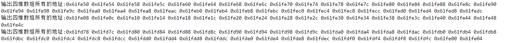
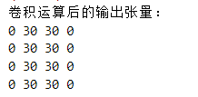
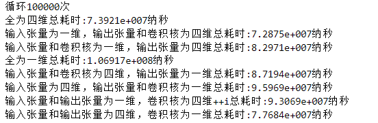

# 实验环境

cpu型号：Inter i5-9300H(2.4GHz)

操作系统：win10

编译器：gcc version 9.2.0 (MinGW.org GCC Build-2) （编译时优化等级为o0）

# 四维数组地址

测试的四维数组

```c++
    int I[1][1][6][6]={
        {
            {
                {10,10,10,0,0,0},
                {10,10,10,0,0,0},
                {10,10,10,0,0,0},
                {10,10,10,0,0,0},
                {10,10,10,0,0,0},
                {10,10,10,0,0,0}
            }
        }
    };

    int I2[1][2][3][3]={
        {
            {
                {10,10,0},
                {10,10,0},
                {10,10,0}
            },
            {
                {10,10,0},
                {10,10,0},
                {10,10,0}
            }
        }
    };

    int I3[2][2][3][3]={
        {
            {
                {10,10,0},
                {10,10,0},
                {10,10,0}
            },
            {
                {10,10,0},
                {10,10,0},
                {10,10,0}
            }
        },
        {
            {
                {10,10,0},
                {10,10,0},
                {10,10,0}
            },
            {
                {10,10,0},
                {10,10,0},
                {10,10,0}
            }
        }
    };
```

测试代码

```c++
cout <<"输出四维数组所有的地址:";
    for(int i=0;i<1;++i){
        for(int j=0;j<1;++j){
            for(int k=0;k<6;++k){
                for(int l=0;l<6;++l){
                    cout << &I[i][j][k][l] <<" ";
                }
            }
        }
    }
```

运行结果：



结论：

测了三个四维数组。从结果可以看到相连两个元素的地址相差4，每个四维数组中每个元素在内存中都是连续的。多维数组在内存中是其实是一维连续存储的。

# 在一维数组中存四维数组并实现七层循环

```c++
/输入张量I
 int I[36] = {10,10,10,0,0,0,10,10,10,0,0,0,10,10,10,0,0,0,10,10,10,0,0,0,10,10,10,0,0,0,10,10,10,0,0,0};
 int in=1;int ic=1;int ih=6;int iw=6;//依次为批次，纬度，行数，列数
```

假设$I1$为四维，$I2$为一维，对应关系如下：

```c++
 I1[i][j][k][l]=I2[i*ic*ih*iw+j*ih*iw+k*iw+l]
```

用一维数组实现七层循环的代码：

```c++
//输入张量I
    int I[36] = {10,10,10,0,0,0,10,10,10,0,0,0,10,10,10,0,0,0,10,10,10,0,0,0,10,10,10,0,0,0,10,10,10,0,0,0};
    int in=1;int ic=1;int ih=6;int iw=6;//依次为批次，纬度，行数，列数
    //卷积核F
    int F[9] = {1,0,-1,1,0,-1,1,0,-1};
    int fn=1;int fc=1;int fh=3;int fw=3;
    //输出张量O
    int O[16] = {0,0,0,0,0,0,0,0,0,0,0,0,0,0,0,0};
    int on=1;int oc=1;int oh=4;int ow=4;
    
    //依次为O的批次，O的纬度，O的行，O的列，F的纬度，F的行，F的列
    for(int i=0; i<on;i++){
        for(int j=0;j<oc;j++){
            for(int m=0;m<oh;m++){
                for(int n=0;n<ow;n++){
                    for(int r=0;r<fc;r++){
                        for(int u=0;u<fh;u++){
                            for(int v=0;v<fw;v++){
                                O[i*oc*oh*ow+j*oh*ow+m*ow+n]+=I[i*ic*ih*iw+r*ih*iw+(m+u)*iw+n+v]*F[j*fc*fh*fw+r*fh*fw+u*fw+v];

                            }
                        }
                    }
                }
            }
        }
    }
```

输出输出张量：

```c++
    cout << "卷积运算后的输出张量：";
    for(int i=0;i<on;++i){
        for(int j=0;j<oc;++j){
            for(int k=0;k<oh;++k){
                cout <<"\n";
                for(int l=0;l<ow;++l){
                    cout << O[i*oc*oh*ow+j*oh*ow+k*ow+l] <<" ";
                }
            }
        }
    }
```

运行结果



结果符合预期，和直接用四维数组运算一样。

# 比较速度

测试代码

```c++
void example1(){
    //输入张量I
    int I[1][1][6][6]={
        {
            {
                {10,10,10,0,0,0},
                {10,10,10,0,0,0},
                {10,10,10,0,0,0},
                {10,10,10,0,0,0},
                {10,10,10,0,0,0},
                {10,10,10,0,0,0}
            }
        }
    };
    int in=1;int ic=1;int ih=6;int iw=6;//依次为批次，纬度，行数，列数
    //卷积核F
    int F[1][1][3][3]={
        {
            {
                {1,0,-1},
                {1,0,-1},
                {1,0,-1}
            }
        }
    };
    int fn=1;int fc=1;int fh=3;int fw=3;
    //输出张量O
    int O[1][1][4][4]={
        {
            {
                {0,0,0,0},
                {0,0,0,0},
                {0,0,0,0},
                {0,0,0,0}
            }
        }
    };
    int on=1;int oc=1;int oh=4;int ow=4;

     //依次为O的批次，O的纬度，O的行，O的列，F的纬度，F的行，F的列
    for(int i=0; i<on;i++){
        for(int j=0;j<oc;j++){
            for(int m=0;m<oh;m++){
                for(int n=0;n<ow;n++){
                    for(int r=0;r<fc;r++){
                        for(int u=0;u<fh;u++){
                            for(int v=0;v<fw;v++){
                               O[i][j][m][n]+=I[i][r][m+u][n+v]*F[j][r][u][v];
                            }
                        }
                    }
                }
            }
        }
    }


}


    int index = 100000;
    cout <<"循环"<< index <<"次";
    auto beforeTime = chrono::steady_clock::now();
    for(int i=0;i<index;++i){
        example1();
    }
    auto afterTime = chrono::steady_clock::now();
    double time = chrono::duration<double, nano>(afterTime - beforeTime).count();
    cout << "\n全为四维总耗时:" << time << "纳秒";
```

运行结果：



结论:

输入张量输出张量卷积核全四维数组最快，全为一维数组最慢，一维数组用的越多越慢。猜测是通过计算一维数组的下标找到对应元素要比直接用四维数组的下标慢。

