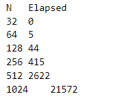
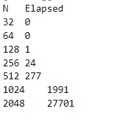
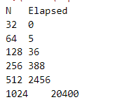

# 实验环境

cpu型号：Inter i5-9300H(2.4GHz)

操作系统：win10

编译器：gcc version 9.2.0 (MinGW.org GCC Build-2) （编译时优化等级为o0）

# 定义矩阵类

```c++
class Matrix{
private:
  size_t num_rows_,num_cols_;
  std::vector<double> storage_;
public:
  //构造函数
  Matrix(size_t M,size_t N)
    :num_rows_(M),num_cols_(N),storage_(num_rows_*num_cols_){}
  Matrix(size_t M,size_t N,double init)
    :num_rows_(M),num_cols_(N),storage_(num_rows_*num_cols_,init){}
  
  //获取指定位置的元素
  double &operator()(size_t i,size_t j){return storage_[i*num_cols_+j];}
  const double &operator()(size_t i,size_t j)const{return storage_[i*num_cols_+j];}
  //获取行列数量
  size_t num_rows() const {return num_rows_;}
  size_t num_cows() const {return num_cols_;}

};
```

# 测试代码

```c++
cout << "N\tElapsed" << endl;
    for(int N=32;N <= 1024;N*=2){
        Matrix A(N,N,1),B(N,N,1),C(N,N,0);

        Timer T;T.start();
        multiply(A,B,C);
        T.stop();

        cout << N << "\t" << T.elapsed() << endl;
    }
```

# 未优化的矩阵乘法

```c++
void multiply(const Matrix& A,const Matrix& B,Matrix& C){
    for(size_t i=0;i<C.num_rows();++i){
        for(size_t j=0;j<C.num_cows();++j){
            for(size_t k=0;k<A.num_cows();++k){
                C(i,j)+=A(i,k)*B(k,j);
            }
        }
    }
}
```

运行结果：（以下结果的时间单位都是ms）


# 编译时选择O2级别优化

```json
"cpp": "cd $dir && g++ -O2 $fileName -o $fileNameWithoutExt && $dir$fileNameWithoutExt"
```

运行结果：


# Hoisting

```c++
void multiply_hoisting(const Matrix& A,const Matrix& B,Matrix& C){
    for(size_t i=0;i<C.num_rows();++i){
        for(size_t j=0;j<C.num_cows();++j){
            double t = C(i,j);
            for(size_t k=0;k<A.num_cows();++k){
                t+=A(i,k)*B(k,j);
            }
            C(i,j) = t;
        }
    }
}
```

运行结果


设置优化级别O2后的运行结果


#  Unroll and Jam

```c++
void multiply_tiled2x2(const Matrix& A,const Matrix& B,Matrix& C){
    for(size_t i=0;i<C.num_rows();i += 2){
        for(size_t j=0;j<C.num_cows();j += 2){
            for(size_t k=0;k<A.num_cows();++k){
                C(i,j)+=A(i,k)*B(k,j);
                C(i,j+1)+= A(i,k)*B(k,j+1);
                C(i+1,j)+=A(i+1,k)*B(k,j);
                C(i+1,j+1)+=A(i+1,k)*B(k,j+1);
            }
        }
    }
}
```

上面的代码为2x2，一次运行得到的C的元素的大小

------

2×2运行结果：


设置优化级别O2后的运行结果：


2×4结果：



设置优化级别O2后的运行结果：



4×2结果：



设置优化级别O2后的运行结果：


4×4运行结果：


设置优化级别O2后的运行结果：


------

没设置优化计算矩阵的大小最大只到1024是因为我的电脑运行计算2048x2048的矩阵实在要太久。设置优化后只计算1024x1024大小的矩阵各个方法差异不够明显

------

# 结论

使用O0级别优化（第一列为矩阵大小NxN中的N。时间的单位为ms）

|      | 原生  | Hoisting | 2x2   | 2x4   | 4x2   | 4x4   |
| ---- | ----- | -------- | ----- | ----- | ----- | ----- |
| 32   | 0     | 0        | 1     | 0     | 0     | 0     |
| 64   | 4     | 4        | 5     | 5     | 5     | 6     |
| 128  | 39    | 29       | 41    | 44    | 36    | 37    |
| 256  | 464   | 328      | 369   | 415   | 388   | 403   |
| 512  | 3223  | 2336     | 2715  | 2622  | 2456  | 2441  |
| 1024 | 30929 | 27299    | 22001 | 21572 | 20400 | 20167 |

使用O2级别优化（第一列为矩阵大小NxN中的N。时间的单位为ms）

|      | 原生  | Hoisting | 2x2   | 2x4   | 4x2   | 4x4   |
| ---- | ----- | -------- | ----- | ----- | ----- | ----- |
| 32   | 0     | 0        | 0     | 0     | 0     | 0     |
| 64   | 0     | 0        | 0     | 0     | 0     | 0     |
| 128  | 2     | 2        | 1     | 1     | 2     | 1     |
| 256  | 30    | 30       | 22    | 24    | 25    | 22    |
| 512  | 399   | 308      | 262   | 277   | 285   | 241   |
| 1024 | 3801  | 2861     | 1934  | 1991  | 2560  | 1926  |
| 2048 | 51669 | 50603    | 31976 | 27701 | 28863 | 23337 |

使用O0级别优化的GFLOPS

|      | 原生      | Hoisting  | 2x2       | 2x4       | 4x2       | 4x4       |
| ---- | --------- | --------- | --------- | --------- | --------- | --------- |
| 64   | 0.131072  | 0.131072  | 0.104858  | 0.104858  | 0.104858  | 0.0873813 |
| 128  | 0.107546  | 0.144631  | 0.1023    | 0.0953251 | 0.116508  | 0.11336   |
| 256  | 0.0706339 | 0.1023    | 0.0909334 | 0.0808541 | 0.0864805 | 0.0832616 |
| 512  | 0.0832875 | 0.119     | 0.0988713 | 0.102378  | 0.109298  | 0.109969  |
| 1024 | 0.0694327 | 0.0786653 | 0.0976085 | 0.0995496 | 0.105269  | 0.106485  |

使用O2级别优化的GFLOPS

|      | 原生     | Hoisting | 2x2      | 2x4      | 4x2      | 4x4      |
| ---- | -------- | -------- | -------- | -------- | -------- | -------- |
| 256  | 1.11848  | 1.11848  | 1.5252   | 1.3981   | 1.34218  | 1.5252   |
| 512  | 0.672771 | 0.871544 | 1.02456  | 0.969081 | 0.941879 | 1.11384  |
| 1024 | 0.564979 | 0.750606 | 1.11038  | 1.0786   | 0.838861 | 1.115    |
| 2048 | 0.332499 | 0.339503 | 0.537274 | 0.620189 | 0.595221 | 0.736164 |

O2级别优化的情况下，64x64的矩阵相乘所用时间太小（1和2ms），误差太大，算出来的结果比CPU的频率还高，所以没放进去

------


在优化级别O2的情况下GFLOPS远大于在优化级别O0的情况，差了差不多10倍。总体来说矩阵越大，GFLPS在降低。不进行优化的矩阵乘法GFLPS最低，矩阵大小越大Hoisting效果越差。同时计算多个乘积累计的情况，GFLOPS并没有跟着同时计算的数量倍数增大而倍数增大（4x4的GFLOPS并不是2x2的几倍，反而是效果差不多）
